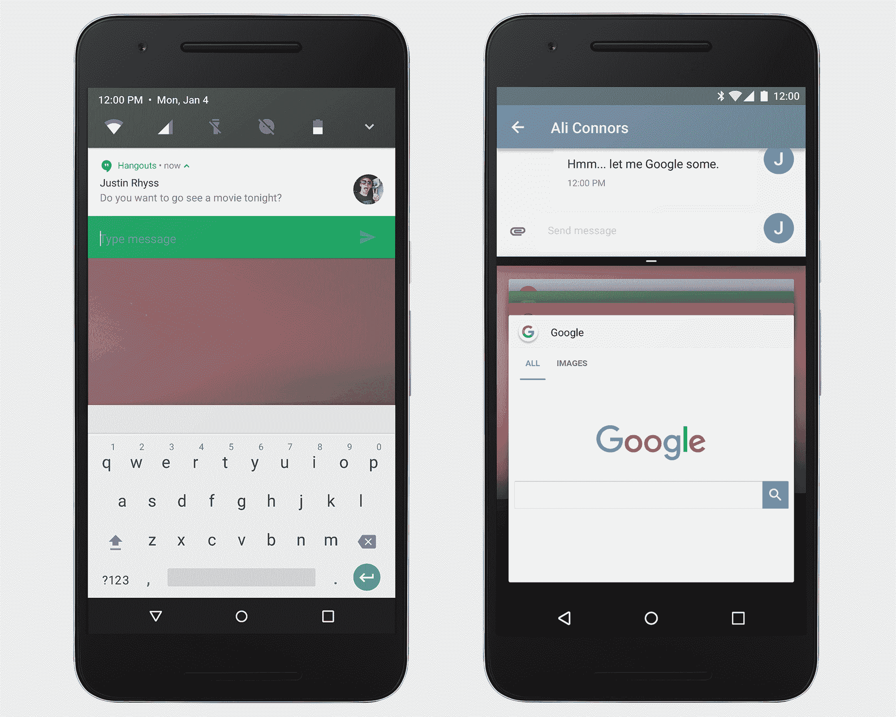
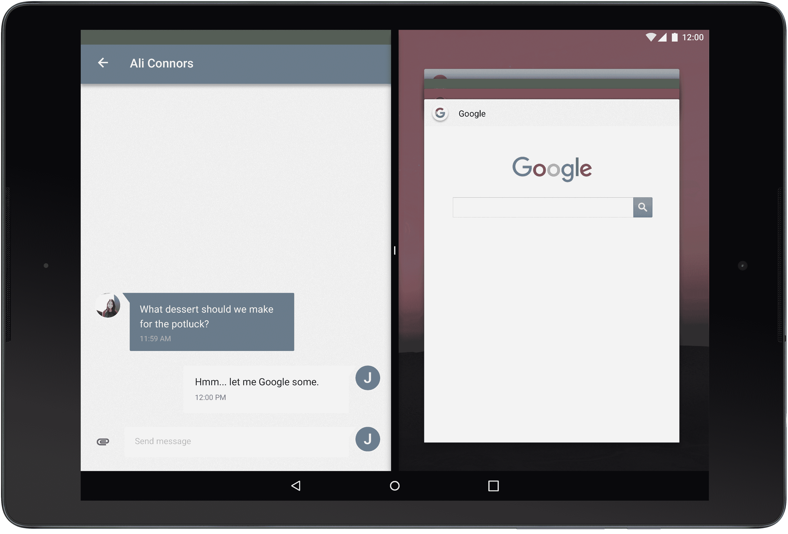

# 惊喜！谷歌发布 Android N 开发者预览版

> 原文：<https://web.archive.org/web/https://techcrunch.com/2016/03/09/google-surprises-with-early-preview-of-android-n/>

谷歌今天出人意料地宣布[Android N 开发者预览版](https://web.archive.org/web/20221007024949/http://developer.android.com/preview/index.html?utm_campaign=android_launch_n_030916&utm_source=anddev&utm_medium=blog)。为了让开发者和喜欢冒险的用户更容易操作，预览版以无线更新的形式提供。

人们期望谷歌在五月的输入/输出开发者大会之前不会开始谈论 T4 的 Android N T5。相反，它决定采用一种非常不同的方法。

谷歌负责 Android、Chrome OS 和 Chromecast 的 SVP Hiroshi Lockheimer 在 Medium today (是的，Medium 和 not Blogspot)上写道，该团队决定更早地发布预览版，以便在这个过程中更早地获得开发者的反馈，并在今年夏天将最终的 N 版发布到设备制造商手中。谷歌目前的计划是在 2016 年第三季度发布五个预览版和一个最终版。

“当我们展望下一个版本的 Android 、 N 时，您会注意到一些针对开发人员的重大变化:它比以往任何时候都更早，更容易尝试，并且我们正在扩展您给我们反馈的方式。洛克海默写道:“我们希望这些变化将确保你的意见得到倾听和反映——这正是 Android 变得更加强大的原因。”。他还指出，这一早期版本将帮助开发者增加对 Android N 新功能的支持。

谷歌强调，这个版本是一个非常进步的工作。随着时间的推移，谷歌可能会增加一些新功能，但现在，它只是谈论这个新版本的几个亮点(在我们安装预览版后，我们可能会发现更多)。

Android N 的变化包括改进了通知功能。例如，使用“[直接回复通知](https://web.archive.org/web/20221007024949/http://developer.android.com/preview/features/notification-updates.html#direct)，意味着开发者现在可以允许他们的用户直接从通知栏回复收到的通知。开发者现在还可以将来自同一个应用的通知捆绑在一起。

Android 也将首次提供分屏视图。支持这一点的应用程序将能够在平板电脑和手机上与其他应用程序并行运行(开发者可以为他们的应用程序设置最小允许尺寸)。多窗口支持是用户长期以来的要求——尤其是在平板电脑上。举例来说，谷歌自己的 Pixel-C 将会是一款具有这一功能的生产力更高的设备。

除了基本的并排模式，Android N 还将提供画中画模式，例如，视频应用程序可以在 Android 电视设备的角落播放。

Android Marshmallow 目前只在 2.3%的 Android 设备上运行，谷歌推出了 Doze 功能，当设备静止一段时间后，它会进入深度节能模式。

在 Android N 中，谷歌进一步推进了这一概念，允许 Doze 在屏幕关闭时节省更多电池电量。此外，谷歌表示，它将继续努力降低 Android 的内存消耗，并提高后台运行的应用程序的效率。

开发人员可以期待的 Android N 的另一个新方面是改进的 Java 8 语言支持。由于这一点，开发人员现在可以使用 Android Jack 编译器来使用 lambdas 等功能，这减少了他们必须编写的样板代码的数量。

这适用于从 Gingerbread up 开始的所有 Android 版本，但 Android N 开发者也将能够使用默认和静态方法、流和功能接口。

那么今天如何才能拿到 Android N 呢？如果你不介意东西不工作或随机中断，谷歌会让你[注册](https://web.archive.org/web/20221007024949/http://www.google.com/android/beta)的空中下载(OTA)更新(尽管正如谷歌发言人告诉我们的那样，该链接要到今天下午晚些时候才会上线)。当然，前提是你拥有一台 Nexus 设备。

该更新适用于谷歌的 Nexus 6、Nexus 5X、Nexus 6P、Nexus Player、Nexus 9 和 Pixel C 设备。这里缺少的一个设备是旧的 Nexus 5。一旦你更新了你的设备，谷歌也会在新的更新发布时继续推送。

除了 OTA 更新，谷歌还将继续为所有支持的设备和 Android 模拟器提供系统映像。

鉴于棉花糖还没有出现在 3%的设备上，谷歌似乎有点急于推出 Android N 有点令人惊讶。尽管如此，Android N 的预览版仍然有一些面向用户的变化，接下来的几个版本也会带来新的功能。然而，就目前而言，谷歌只把重点放在少数几个面向开发者的新功能上。

不过，该公司肯定还没有透露的一件事是，一旦发布最终版本，这个“N”将代表什么样的甜点/糖果。我选“纳特拉”，因为洛克海默的帖子说他“还没告诉你”。"