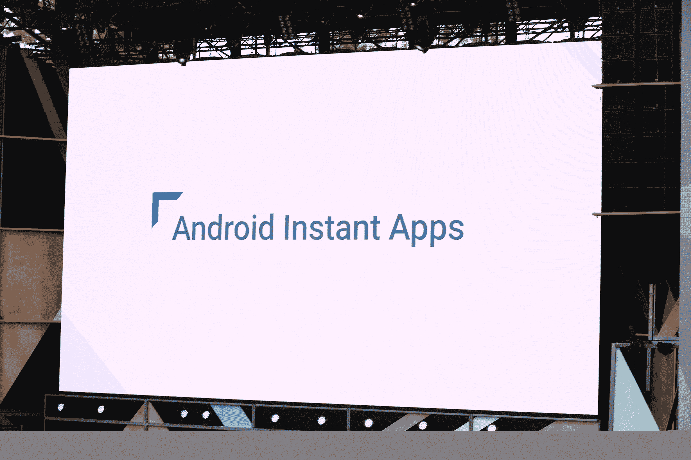

# 谷歌采用了一种新的方法来开发针对安卓的即时应用程序

> 原文：<https://web.archive.org/web/https://techcrunch.com/2016/05/18/google-takes-a-new-approach-to-native-apps-with-instant-apps-for-android/>

 移动应用通常比基于浏览器的网络应用提供更好的用户体验，但是你首先要找到它们，下载它们，然后试着不要忘记你安装了它们。现在，谷歌希望我们重新思考什么是移动应用，以及我们如何与它们互动。

[即时应用](https://web.archive.org/web/20221207014718/https://developer.android.com/topic/instant-apps/index.html)是谷歌在今天的输入/输出开发者大会上宣布的一项新的安卓功能，但计划缓慢推出。该功能希望通过点击一个网址，让你几乎可以立即使用本地应用程序，即使你以前没有安装它们。

通常，下载和安装应用程序需要一段时间，但是有了即时应用程序，开发人员将不得不把他们的应用程序划分成几秒钟内就可以启动的小的、可运行的部分。

“即时应用实际上是重新思考应用的发展方向，”谷歌负责安卓工程的副总裁戴夫·伯克告诉我。即时应用背后的想法是让本地应用的体验和浏览网站一样方便。“网页是短暂的，”他说。“它们出现了，你使用了它们，再也不去想它们了。”他认为，应用程序有很大的摩擦，通常你只希望应用程序执行一个动作或获取一条特定的信息。

正如谷歌的 Michael Siliski 和 Ficus Kirkpatrick 告诉我的，这里的想法是让移动体验在渲染标准移动网页的同时开始。虽然该团队仍在研究极限，但 Siliski 和 Kirkpatrick 预计即时应用程序的下载量将低于 4 兆字节。

实际情况是这样的:假设你在一个新城市，想用当地政府使用的任何停车应用支付停车费。你把手机放在停车计时器上，内置的 NFC 芯片读取信息，本地应用程序几乎瞬间出现。不需要下载应用程序，甚至不需要登录(或者稍后卸载)。

他们认为，这里的重点是让体验尽可能无缝。例如，因为你已经登录了你的手机，应用程序将允许你用你的谷歌钱包账户支付，然后再次消失。“有几类应用作为原生应用更好，但由于安装障碍，没有得到这样的体验，”西里斯基说。

谷歌还与 Buzzfeed 合作进行了一项早期测试，让你打开 BuzzFeed 视频应用程序的即时版本来观看视频，并与 B & H 合作展示开发者如何使用这一功能来获得特别的在线购物体验。

当然，开发人员必须做一些工作来启用所有这些新功能。Kirkpatrick 指出，这更像是对现有应用的升级，而不是完全重写。他们仍然可以使用相同的源代码，一些开发人员可能能够在短短一天内实现即时应用支持(当然，假设他们有一个非常基本的应用)。

应用程序将在一个安全的沙箱中运行，这个功能一旦发布，将一直工作到 Android Jelly Bean。

伯克将这种新型应用背后的想法与当前围绕机器人的炒作联系起来。它们也承诺让执行某些动作变得更容易，而不必为每个任务安装新的应用程序。然而，正如伯克所说，鉴于你必须经历多个步骤，可能还要键入一堆句子才能完成任何事情，机器人实际上并不那么方便。他说，即时应用程序给你“机器人的好东西，没有负面影响。”

不过，在你看到任何即时应用之前，可能还需要一段时间。谷歌今天宣布这项功能是为了收集开发者的意见。它已经与一些早期的测试人员一起工作，团队认为它已经准备好提供今天的功能预览。使用即时应用程序的功能将在今年晚些时候向用户推出，谷歌计划在明年扩大使用这一功能的开发者群体。

为什么这么慢？该公司认为这是一个很难实现的功能。“开发者体验有很多变化，我们希望确保我们做对了，”Siliski 说。

谷歌在过去已经尝试了许多方法来弥合网络和原生应用之间的差距，包括在搜索中显示来自 Android 和 iOS 应用的内容，甚至从云端流式传输虚拟化应用。但是即时应用程序是为了让下载和使用真正的本地应用程序更加无缝和自然。

此举正值应用商店内容泛滥，消费者越来越不愿意寻找和尝试新的应用程序。2015 年的一项研究表明，[消费者 85%的时间花在使用应用程序的智能手机上，](https://web.archive.org/web/20221207014718/https://beta.techcrunch.com/2015/06/22/consumers-spend-85-of-time-on-smartphones-in-apps-but-only-5-apps-see-heavy-use/)但他们只是定期使用少数第三方应用程序。

消费者行为的这种转变意味着开发者很难将他们的应用程序放到用户的设备上——如果实施正确，即时应用程序可以帮助解决这一问题。