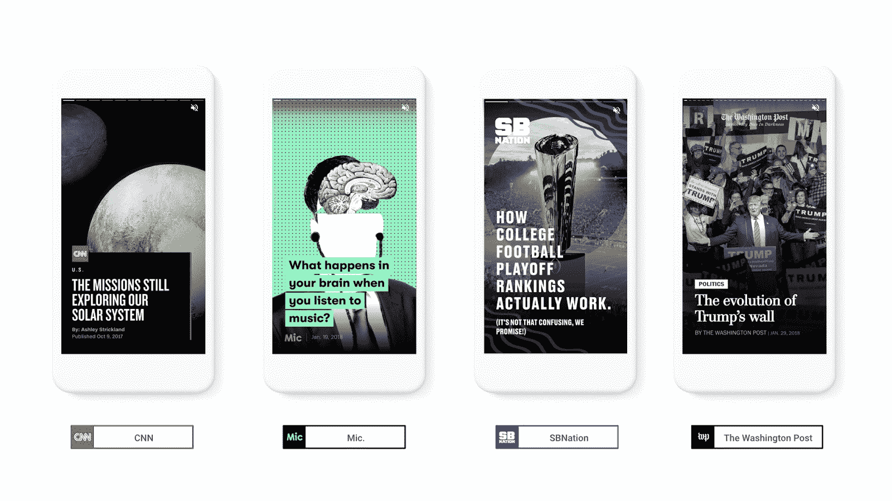

# 谷歌以其新的故事格式 TechCrunch 超越了基本帖子

> 原文：<https://web.archive.org/web/https://techcrunch.com/2018/02/13/google-takes-amp-beyond-basic-posts-with-its-new-story-format/>

在很大程度上，谷歌的加速移动页面项目就是顾名思义:加速移动页面。不出所料，这主要意味着快速加载和呈现新闻网站上的现有文章、食谱和其他文本内容。随着 AMP 的这一部分现在相当成功(如果不是一直受欢迎的话)，谷歌正在寻求超越这些基本故事的 AMP。在阿姆斯特丹举行的 [AMP Conf](https://web.archive.org/web/20221230062626/https://www.ampproject.org/amp-conf/) 上，该公司今天宣布推出 [AMP 故事格式](https://web.archive.org/web/20221230062626/https://www.ampproject.org/stories)。

这里的总体想法与你可能已经熟悉的 Instagram 和 Snapchat 等公司的故事格式没有太大不同。这种新的格式允许出版商为移动设备创建图像、视频和动画内容丰富的故事，你可以轻松浏览。上周我与谷歌 AMP 项目的产品经理鲁迪·高尔菲(Rudy Galfi)交谈时，他称之为“这是一种专注于移动的格式，用于创造视觉上丰富的故事”。"它打开门，创造出视觉上有趣的故事."  为了推出这种形式，谷歌与 CNN、Conde Nast、Hearst、Mashable、Meredith、Mic、Vox Media 和 Washington Post 合作。像所有 AMP 一样，这是一个开源项目，出版商可以根据需要扩展它。

这里的想法是，随着时间的推移，开始在谷歌的搜索结果中出现 AMP 故事。不过，目前这只是一个预览版，意在给开发者和出版商时间来支持这种新格式。

的确，出版商可能注意到的第一件事是，还没有建立 AMP 故事的工具。在某种程度上，当谷歌第一次为常规帖子展示 AMP 时也是如此，尽管开发人员很快为所有流行的 CMS 系统编写了插件来支持它。“一直与 AMP stories 合作的出版商设法与他们现有的 CMS 系统建立了相当简单的集成，”Galfi 告诉我们。

然而，即使工具可用，出版商也将不得不从头开始创建 AMP 故事。他们不能简单地回收一个现有的帖子，贴上一张图片，然后就此收工。那么，AMP story 格式的成功将是在不增加开发人员开销的情况下，为构建这些故事提供合适的工具，开发人员不一定会对谷歌推出另一种格式感到高兴，这种格式在未来可能支持，也可能不支持。

目前还不清楚谷歌将如何在搜索中显示这些故事，以及出版商如何确保它们会被包括在内。因为这些 AMP 故事与常规帖子是分开的，所以当新故事上线时，谷歌可能会给出版商另一种方式来 ping 它。

 现在，如果你想尝试一个 AMP [的故事](https://web.archive.org/web/20221230062626/https://g.co/ampstories)，到这里搜索一个由发布伙伴。您将在搜索结果中新的“视觉故事来源”标题下找到 AMP 故事。

虽然我不确定出版商是否会完全接受这种格式，但我不得不承认，我看到的现有 AMP 故事是一个很好的转移。例如,《华盛顿邮报》用这种格式试验了朝鲜参加奥运会的时间表。不出所料，Vox 将它用于解释者等，Mashable 可能比大多数人走得更远，在它的大部分故事中使用了视频、声音和动画。