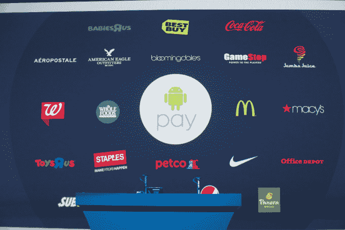

# 谷歌通过 Android Pay TechCrunch 再次尝试移动支付

> 原文：<https://web.archive.org/web/https://techcrunch.com/2015/05/28/google-takes-another-shot-at-mobile-payments-with-android-pay/>

# 谷歌通过 Android Pay 再次尝试移动支付

在今天的 I/O 开发者大会上，谷歌宣布了 Android Pay，这是一个新的移动操作系统自带的支付解决方案。

除了更容易通过 NFC 在商家的销售点支付之外，新系统还允许商家使用 Android Pay API 将支付直接集成到他们销售实物商品和服务的应用程序中，而不是集成像 Venmo 或 PayPal 这样的第三方提供商。

为了给 Android Pay 一个成功的机会，谷歌与美国三大手机运营商进行了合作谈判:美国电话电报公司、威瑞森和 T-Mobile。这些运营商将在他们销售的运行 Android 4.4“kit kat”或更高版本的内置 NFC 的设备上预装 Android Pay。在运行新的 Android M 操作系统的设备上——根据 Android 升级周期历史，一段时间内不会有很多——用户也将能够使用原生指纹支持快速访问和授权支付。

谷歌展示了一些将在近期支持 Android Pay 的主要零售商:

读到这里的三个谷歌钱包粉丝会很高兴地听到这个应用程序仍将存在，尽管它被重新想象成一个在朋友之间发送现金的点对点应用程序，就像我上面提到的服务一样。

[gallery ids="1164006，1164024，1164022，1164020，1164017，1164015，1164013，1164011，1164008，1164007"]

