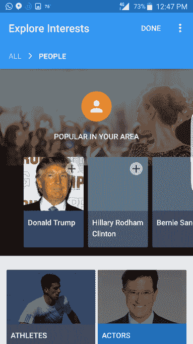

# 谷歌测试其虚拟助手 Google Now TechCrunch 的更个性化版本

> 原文：<https://web.archive.org/web/https://techcrunch.com/2016/08/09/google-tests-a-more-personalized-version-of-its-virtual-assistant-google-now/>

[Google Now](https://web.archive.org/web/20221208230829/https://www.google.com/search/about/learn-more/now/) ，这款捆绑在 Android 和谷歌搜索应用中的智能个人助理，已经能够在正确的时间为你带来你需要的信息，无论是交通提醒、事件提醒、体育比分、股票更新、天气、航班信息等等。但谷歌现在有一个不足之处，那就是根据你的需求更精确地定制助手。

如今，这是通过应用程序设置中的一系列开/关切换开关来实现的，这有点隐藏，也可以通过点击单个项目来告诉应用程序你对那张卡片或那个新闻源“不感兴趣”。

然而，一个名为“探索兴趣”的新功能似乎正在开发中，它将让用户更好地控制谷歌将代表你跟踪什么样的信息，并将更容易地告诉谷歌你想听到更多关于什么样的信息。

这个功能是由[博客 Android Police](https://web.archive.org/web/20221208230829/http://www.androidpolice.com/2016/08/08/google-adds-explore-interests-now-six-categories-get-updates/) 在野外发现的，该博客声称它可能会慢慢推出。然而，谷歌发言人证实“兴趣”是该公司正在测试产品外观和感觉的一项实验，并补充说谷歌目前没有什么可宣布的。

[gallery ids="1366337，1366336，1366338"]

通过“探索兴趣”，谷歌提供了一种不同的方式来跟踪新闻和其他话题，而不仅仅是允许谷歌根据搜索历史或位置等因素被动地确定这些信息。这款应用告诉用户，他们可以“挑选球队、乐队、电影等等”，一次点击就会把他们带到一个屏幕上，屏幕上有彩色瓷砖，显示“体育”、“电视”、“电影”、“音乐家”、“人物”、“股票”等等。

当您深入每个部分时，您可以浏览多个子类别中各个项目的卡片，然后点按加号(+)将项目添加到您正在跟踪的项目列表中。

例如，在“电视”类别下，有一个只有“现实”电视节目的子部分，有像“好声音”、“美国偶像”、“单身汉”等项目，只需点击一下就可以跟踪。与此同时，“人物”部分可能会向您展示像克林顿和特朗普这样的政治家以及运动员、演员和其他人物的卡片。

当您浏览这些部分时，您还可以看到哪些主题“在您所在的地区很受欢迎”，这给 Google Now 兴趣功能带来了一点本地特色。

使用谷歌追踪非常具体的信息的想法已经存在很长时间了，可以追溯到谷歌快讯(T2)的推出。过去几年里，许多创业公司[也来到了](https://web.archive.org/web/20221208230829/https://www.quora.com/What-are-good-low-cost-or-free-alternatives-to-Google-Alerts)，试图优化谷歌提醒体验[，但大多数都专注于](https://web.archive.org/web/20221208230829/https://www.maketecheasier.com/google-alerts-alternatives/)社交提及领域。Google Now(有望)即将推出的“兴趣”部分将提供类似的跟踪功能，但会捆绑到用户每天启动的应用程序中。

能够更好地定制 Google Now 助手对该公司来说是一个关键时刻，因为苹果的 Siri 正在进入 Mac 系统除了 iOS 和 Apple TV，Cortana 也捆绑到 Windows 系统[中，不能完全关闭，](https://web.archive.org/web/20221208230829/https://support.microsoft.com/en-us/instantanswers/0f9db9cd-c346-46f3-afa3-187f9ce290e8/cortana-is-built-in-to-the-windows-anniversary-update)亚马逊的 Alexa 平台正在通过其 Echo 扬声器和其他设备进入客户的家庭。因此，谷歌面临的挑战是，不仅要让它的助手变得实用和主动，提供你需要知道的事情——比如什么时候去开会——还要让它成为一个工具，跟踪你*也想*知道的事情。

*图片鸣谢:[安卓警察](https://web.archive.org/web/20221208230829/http://www.androidpolice.com/2016/08/08/google-adds-explore-interests-now-six-categories-get-updates/)*