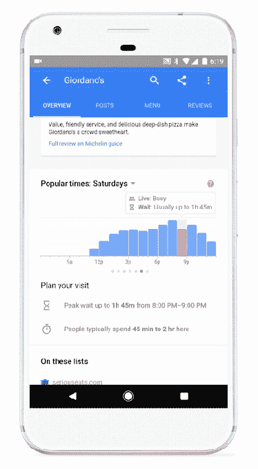

# 谷歌将在谷歌搜索和地图中增加餐馆等候时间，杂货店紧随其后 

> 原文：<https://web.archive.org/web/https://techcrunch.com/2017/11/07/google-to-add-restaurant-wait-times-to-google-search-and-maps-followed-by-grocery-stores/>

# 谷歌将在谷歌搜索和地图中增加餐馆等候时间，杂货店紧随其后

谷歌今天宣布，它将很快推出谷歌搜索的新功能，随后是谷歌地图，它将向你显示地区餐馆的估计等待时间。这一新增功能是对谷歌现有的显示商业繁忙时间功能的扩展，但也有所调整，可以帮助食客更好地决定他们想在哪里和什么时候吃饭。

几年来，谷歌一直在利用来自谷歌地图用户群的数据来提供这类见解。例如，早在 2015 年夏天，它就开始使用出现在企业名录中的图表向移动网络用户显示当地企业在一周的哪几天和一天中的哪些时间最忙。

去年，它通过提供同样的信息改进了功能，但是是实时的。

谷歌新的餐厅等待时间也来自选择加入谷歌位置历史的用户的聚合和匿名数据——这些数据决定了热门时间、等待时间和访问持续时间。

以餐馆为例，谷歌现在将包括一个弹出框，当你点击流行时报图表中的一个时间段时就会出现。该框显示标记为“忙”、“通常忙”、“通常不忙”等的实时或历史数据。，连同等待时间。

在热门时间图表下面，还有一个部分，通过提供高峰等待时间和持续时间的信息，帮助用户计划他们的访问。(例如，“人们通常在这里呆 45 分钟到 2 小时。”)

新的等待时间功能将在全球近 100 万个餐厅列表中得到支持，最初在谷歌搜索中提供。

随着这一功能的增加，谷歌至少在一定程度上挑战了现有的应用程序，如用于查看餐厅等待时间的 [NoWait](https://web.archive.org/web/20221206122216/https://play.google.com/store/apps/details?id=com.nowaitapp.consumer&hl=en) 。但与谷歌不同的是，NoWait 还允许你把自己的名字放在那些不接受预订的餐厅名单上。

谷歌表示，该功能今天开始推出，一旦上线，你将在手机和桌面上看到餐馆列表中的时间。该公司表示，随后它将推出谷歌地图到安卓系统，届时它将扩展到杂货店。