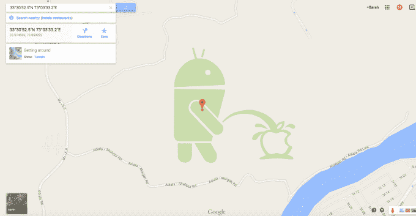
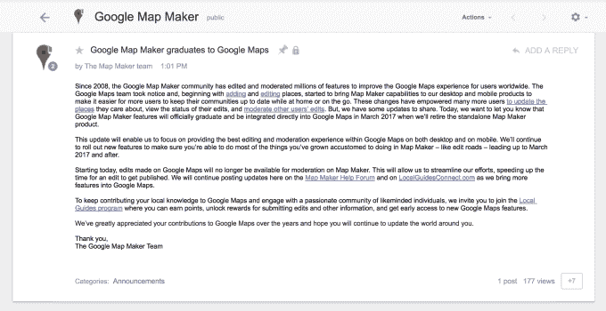

# 谷歌将关闭其众包地图编辑工具 Map Maker

> 原文：<https://web.archive.org/web/https://techcrunch.com/2016/11/08/google-to-shut-down-map-maker-its-crowdsourced-map-editing-tool/>

自 2008 年以来，谷歌运行了一个名为[地图制作商](https://web.archive.org/web/20230307213214/https://www.google.com/mapmaker)的在线工具，允许世界各地的任何人向谷歌地图贡献数据。现在，这个工具正在关闭。公司[今天在其项目在线论坛上宣布](https://web.archive.org/web/20230307213214/https://productforums.google.com/forum/#!topic/map-maker/UEN0wxhj6Rs)谷歌地图制作服务，作为一个独立产品，将于 2017 年 3 月退役。然而，谷歌地图的众包贡献并没有结束，该公司指出，相反，这些将被转移到[谷歌的当地导游计划](https://web.archive.org/web/20230307213214/https://maps.google.com/localguides/)。

从某种程度上来说，本地指南是有着多年历史的地图制作服务的现代化版本。

旧的服务提供了一个在线工具和编辑器，允许任何人向谷歌地图提交更新，然后版主可以批准。更大的目标是用欠发达地区的道路和商业信息来填充谷歌地图，这些地区没有详细的本地地图。

然而，你可能还记得，Map Maker 的众包功能也让谷歌在过去几年陷入了麻烦。例如，在 2015 年， [Map Maker 被用来破坏谷歌地图](https://web.archive.org/web/20230307213214/https://techcrunch.com/2015/04/24/google-works-to-improve-spam-detection-systems-on-google-maps-after-obscene-edits/)，上面有一幅谷歌 Android 角色在苹果标志上撒尿的图像。在这次和其他垃圾邮件攻击和淫秽编辑之后，公司[不得不暂时关闭 Map Maker】。](https://web.archive.org/web/20230307213214/https://techcrunch.com/2015/05/11/google-shuts-down-map-maker-following-hacks/)

就在地图制造商努力监管其社区的时候，谷歌[正在开发](https://web.archive.org/web/20230307213214/https://techcrunch.com/2015/02/06/google-takes-on-yelp-elites-with-its-new-local-guides-program/)的[当地导游](https://web.archive.org/web/20230307213214/https://maps.google.com/localguides/)项目。

该计划开始类似于谷歌自己的 Yelp Elites 版本，今天为志愿者提供了一种为谷歌地图和谷歌企业列表做出贡献的方式，以换取积分、奖励以及特殊活动的邀请和早期访问新功能。

导游可以通过各种任务获得积分，如撰写评论、添加或编辑地点、发布照片等。

然而，Map Maker 提供了一个扩展的功能集，例如，包括编辑道路的功能。其独特的功能集将与当地指南合并，为 2017 年 3 月的关闭以及 Map Maker 关闭做准备。

当这些功能可用时，它们将被发布到两个产品网站上:[地图制作者帮助论坛](https://web.archive.org/web/20230307213214/https://productforums.google.com/forum/#!forum/map-maker)和[LocalGuidesConnect.com](https://web.archive.org/web/20230307213214/https://www.localguidesconnect.com/t5/News-Updates/bg-p/NewsUpdates)。

此外，从今天开始，提交到谷歌地图的编辑内容将不再由 Map Maker 审核。该公司表示，这是为了让谷歌能够简化工作，加快发布这些编辑的时间。

鉴于地图制作商和当地导游这两个项目之间的重叠，关闭是有道理的。得益于更新的编辑和审批系统，这种转变也将减少垃圾邮件和恶意破坏的问题。

然而，在 Map Maker 关门之前，谷歌是否能够将其全套 Map Maker 编辑工具转移到更新的平台上仍有待观察。

谷歌过去常常大批量宣布产品停产，称为“春季大扫除”但这一次(以及今年秋天)，该公司更加低调地关闭了服务，没有大张旗鼓。例如，昨天，[关闭了移动网站 Google Showtimes](https://web.archive.org/web/20230307213214/https://techcrunch.com/2016/11/07/google-quietly-shutters-standalone-google-showtimes-movie-site/) 。

“在过去的一年里，我们推出了新的简单方法，允许人们直接从谷歌地图应用程序和通过谷歌搜索进行编辑，从而帮助他们更新谷歌地图。基于这些努力，以及我们新的本地指南计划，我们决定淘汰 Map Maker，以改善和加快移动和桌面上的地图编辑体验，”谷歌发言人告诉 TechCrunch，该公司决定终止 Map Maker。

“我们非常感谢地图制作社区多年来贡献的数百万次编辑，并鼓励他们通过我们最近推出的贡献渠道和加入不断增长的当地导游社区，继续将他们的当地知识添加到谷歌地图中，”他们补充道。

关于 Map Maker 的完整公告如下:

