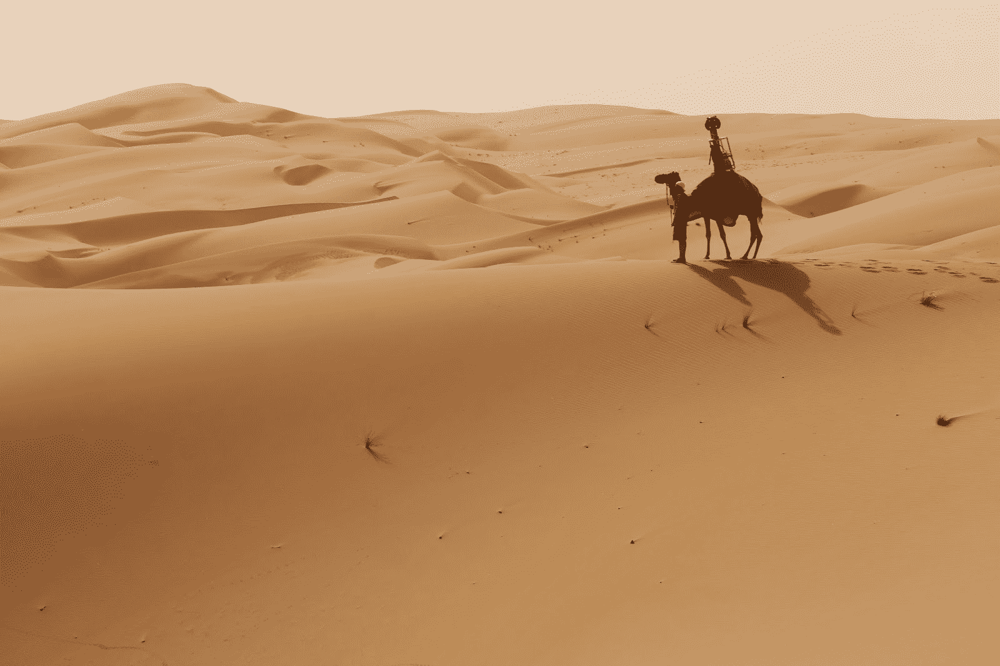

# 谷歌将骆驼变成街景车来绘制里瓦沙漠地图

> 原文：<https://web.archive.org/web/http://techcrunch.com/2014/10/08/google-turned-a-camel-into-a-street-view-car-to-map-the-liwa-desert/>

# 谷歌把一只骆驼变成了街景车，用来绘制里瓦沙漠的地图

【YouTube https://www.youtube.com/watch?v=4pVCToDTbT4&w=560&h=315]

谷歌开始在沙滩上扩展其全球街景图像，使用其经过修改并安装在真实骆驼驼峰上的 Trekker 相机包来捕捉来自阿拉伯联合酋长国 [Liwa 沙漠](https://web.archive.org/web/20230326184022/http://google-latlong.blogspot.com/2014/10/roam-arabian-desert-with-street-view.html)的照片，这是一个直接来自幻想故事的原始仙境。使用骆驼是为了避免对周围环境造成任何影响，自石器时代晚期以来，这里一直是人类定居者的家园。

谷歌使用 Trekker pack 来捕捉其汽车不能或不应该行走的街景图像——尽管传统上，它们是由人类而不是单峰骆驼穿着和携带的。谷歌此前已经使用 Trekker 绘制了[大峡谷](https://web.archive.org/web/20230326184022/https://techcrunch.com/2012/10/24/google-takes-its-backpack-sized-trekker-street-view-cameras-to-the-grand-canyon/)、加拿大[北国](https://web.archive.org/web/20230326184022/https://techcrunch.com/2013/03/20/google-hands-street-view-trekker-over-to-a-local-to-get-imagery-of-canadas-arctic-territory/)和许多其他目的地的地图。在 2013 年的 I/O 开发者大会上，我们用这个工具包“背”了一下，看看它是什么样的，骆驼应该不会有太大的负载问题。

谷歌的这个项目揭示了一些令人惊叹的图像和一个许多人可能永远无法亲自前往的地方的广阔前景，这是其扩展的街景程序的魔力。高科技影像设备与古老的交通工具相结合，简直是锦上添花。

