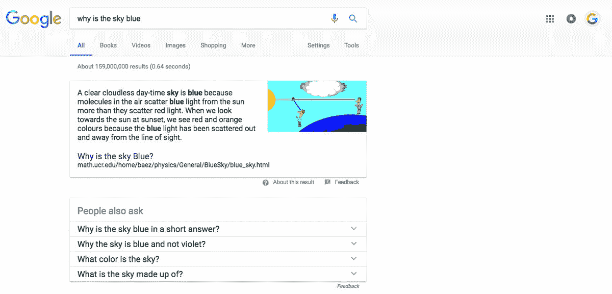

# 谷歌调整搜索以帮助打击“假新闻”

> 原文：<https://web.archive.org/web/https://techcrunch.com/2017/04/25/google-tweaks-search-to-help-combat-fake-news/>

谷歌对搜索的工作方式进行了一些调整，旨在提高返回结果的总体质量，更具体地说，是为了打击“假新闻”的问题，根据谷歌负责搜索的工程副总裁本·戈麦斯(Ben Gomes)的博客文章，谷歌认为“假新闻”是指“网络上的内容，这些内容[助长了公然误导、低质量、冒犯性或完全虚假的信息的传播”。

谷歌指出，确保这样的内容不会在搜索查询中出现是一项长期的努力，但它正在对今天的搜索工作方式进行一些基本的改变，希望有助于加快实现这一结果。它不仅涉及对搜索排名工作方式的技术方面进行改变，还涉及为用户提供更多工具，使其易于提供反馈，并使任何人都更容易看到搜索如何工作，这样人们就可以更好地理解为什么当他们出错时会出错，以及当他们要求谷歌修复时会发生什么。

谷歌承认，一些查询虽然表面上无伤大雅，但返回的是“冒犯性或明显误导性的内容”，这实际上并不是搜索者想要找到的内容。它表示，这种情况只占其每日总搜索流量的 0.25%左右，但对于每天使用谷歌搜索的活跃用户群来说，这仍然是一个很大的查询数量。

谷歌已经采取措施修复这些负面结果，包括改变[搜索质量评分员](https://web.archive.org/web/20221207190621/https://static.googleusercontent.com/media/www.google.com/en//insidesearch/howsearchworks/assets/searchqualityevaluatorguidelines.pdf)的指导方针，这些指导方针告诉真实的人帮助谷歌识别潜在的攻击性材料，以更具体的方式寻找不良结果。谷歌表示，虽然搜索评分者的反馈不会直接影响单个页面的搜索排名，但它确实有助于他们找出算法失败的地方，并做出相应的调整。新的指导方针特别指出了误导性信息的种类，“意想不到的攻击性结果、恶作剧和未经支持的阴谋论”，当发现这些信息作为谷歌搜索用户相对无害的查询结果返回时，它们一直是批评和愤怒的对象。

【T2

谷歌也在改变它用来直接影响排名的信号，着眼于将低质量的内容推下去。它清楚地说明了它希望通过这些改变来避免什么:类似于去年的事件，谷歌在搜索“大屠杀发生了吗？”是新纳粹网站 Stormfront 的一篇虚假文章。

至于反馈，谷歌现在让个人用户更容易对其自动完成和特色片段功能中出现的冒犯性或不准确的内容提供反馈。在第一种情况下，它们会预测您的查询，在第二种情况下，它们会从排名靠前的结果中提供摘录。这些也经常被批评为出现明显有害的查询假设，让用户更容易直接告诉谷歌何时发生这种情况，应该有助于该公司更容易发现和解决问题。

谷歌还试图让人们更容易发现为什么当糟糕的事情发生时，它会出现在自动完成功能中——该公司表示，它已经“被问及为什么令人震惊或令人不快的预测会出现在该功能中”,这是一种轻描淡写的说法，因为每当自动完成功能返回令人讨厌的响应时，它都会受到公众和媒体的审查。现在，谷歌正在[将其政策](https://web.archive.org/web/20221207190621/https://support.google.com/websearch/?p=blog_autocomplete_policies)(也根据其变化进行更新)公之于众，让每个人都可以访问，这样你就可以看到当自动完成出现问题时它会采取什么措施。