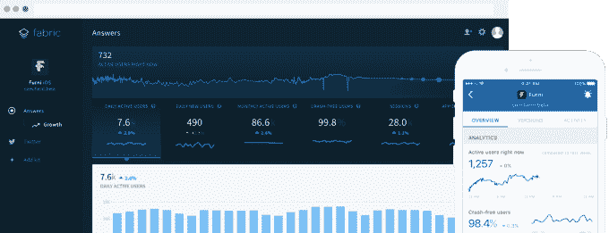
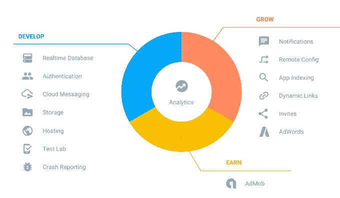

# 谷歌从 Twitter  收购织物开发平台和团队

> 原文：<https://web.archive.org/web/https://techcrunch.com/2017/01/18/google-twitter-fabric/>

谷歌[将接管](https://web.archive.org/web/20230405130056/https://fabric.io/blog/fabric-joins-google) Twitter 的移动应用开发平台 Fabric，以及其 Crashlytics 崩溃报告系统、Answers 移动应用分析、Digits SMS 登录系统和 FastLane 开发自动化系统。Twitter 在 2014 年推出了作为模块化 SDK 的 Fabric，允许开发人员挑选不同的工具来改进他们的应用程序，现在它为 58 万开发人员创建的 25 亿用户提供服务。

但随着 Twitter 试图改善财务状况，它正在削减非必要的部门。通过[将平台转让给谷歌](https://web.archive.org/web/20230405130056/https://firebase.googleblog.com/2017/01/FabricJoinsGoogle_17.html)，它可以消除运行 Fabric 的成本，而不会因为突然关闭 Fabric 而影响其开发者。谷歌将继续运营 Fabric 及其相关工具，开发人员不应该做任何事情来支持过渡。

这就引出了一个问题，Twitter 是在试图瘦身以再次被收购吗？

## 更薄的 Twitter

在去年收购谈判失败后，Twitter 必须自给自足。基本上，如果它赚不到足够的钱，它就会被解雇。这就是为什么 Vine 昨天被关闭，并重新启动为 Vine Camera，它不再托管视频，因为这样会变得很昂贵。现在轮到 Fabric 了，因为 Twitter 显然将企业开发者工具销售视为其核心广告和数据业务的非盈利性绕道。

Twitter 告诉我，它将继续运营和投资其他面向开发者的产品，如其 Publisher platform、Twitter Kit、Gnip、TweetDeck、MoPub，以及其公共 API 和 Ads APIs，因为它们与核心业务直接相关，并符合其 2017 年的优先事项。

Fabric 团队宣布“今天，我们进入了 Fabric 的下一个篇章，并很高兴地宣布，我们已经签署了一份协议，Fabric 将被谷歌收购，我们的团队将加入谷歌的开发人员产品组，与 Firebase 团队合作。”谷歌 Firebase 产品经理 Francis Ma 写道:“我们的使命紧密相连:帮助开发者开发更好的应用并发展他们的业务。”

交易条款没有披露，Twitter 拒绝应要求提供更多细节。谷歌告诉 TechCrunch，所有 Fabric 团队成员都将加入进来。[数字](https://web.archive.org/web/20230405130056/http://get.digits.com/blog/digits-fabric-google)在过渡期仍将由 Twitter 控制。

Crashlytics 将成为 Firebase 的主要崩溃报告工具。Twitter 成立于 2011 年，2013 年以 3820 万美元的普通股加股票期权收购了 Crashlytics，据报道，这笔交易价值超过 1 亿美元。[更正:我们最初没有提到提高 Crashlytics 交易价值的股票期权。]六年后，联合创始人杰夫·塞伯特(Jeff Seibert)将退出 Crashlytics，该公司现在由 Twitter 的工程副总裁里奇·帕雷特(Rich Paret)领导。

虽然 Twitter 本身在中国不被允许，但 Crashlytics 把阿里巴巴和百度等互联网巨头算作用户。Twitter 仍然向中国公司出售广告空间，但它现在已经将其最大的桥梁出售给了中国。

虽然 Twitter 最初对企业访问像 Crashlytics 和 Answers 这样的工具收费，但后来免费了。策略似乎是，如果更多的开发者成为 Twitter 生态系统的一部分，他们将开发搭载在微博服务上的应用，并为其提供额外的功能和平台锁定。

但这一策略对 Twitter 来说可能过于间接，因为它试图减少亏损，2016 年第三季度亏损 1.03 亿美元。[脸书去年同样关闭了其 Parse](https://web.archive.org/web/20230405130056/https://techcrunch.com/2016/01/28/facebook-shutters-its-parse-developer-platform/) 移动开发平台，其创始人 Ilya Sukhar 今天在推特上说，他嫉妒它没有像 Fabric 一样被卖给谷歌。

会有更多的 Twitter 部门被削减、出售或合并吗？例如，Periscope 可以明智地成为 Twitter Live，因为 Twitter 终于增加了直接从自己的应用程序进行广播的能力。如果 Periscope 自己的应用程序的专用直播发现和消费功能没有发挥出应有的作用，那么收缩团队，让该产品完全成为 Twitter 应用程序的一部分可能是有意义的。

如果 Twitter 能够减少员工数量，放弃多余的部门，加强核心产品和业务，它可能会再次出售给拥有资源的人，使其在财务上取得成功。

## 开发者信任谷歌，而不是推特

另一方面，谷歌专注于将移动应用开发者转化为付费客户，从免费开发工具升级到付费层级。它在 7 月份收购了 LaunchKit，让开发者可以更容易地为他们的移动应用创建应用商店截图和网站。

看到亚马逊在 AWS 上的成功，谷歌看到了向不想自己构建应用程序架构的开发者出售其强大后端基础设施的机会。

这不会是 Twitter 开发者第一次觉得自己耍了花招。在 2008-2012 年期间，当 Twitter 迫切需要帮助起步和建立硬核使用时，它为开发者提供 API 来构建自己的 Twitter 客户端。

但在 2012 年底，当它试图在自己的客户应用程序中增加广告业务时，它突然[限制 API 访问](https://web.archive.org/web/20230405130056/https://techcrunch.com/2012/08/16/twitter-api-client-apps/)，实质上扼杀了开发者花了数年时间为 Twitter 的利益构建的几个工具。随后，Twitter 对 DataSift 等 firehose 数据转售商采取了同样的做法，切断了它们的业务，转而对其收购的 Gnip 服务收费。

杰克·多西后来为 Twitter 以这种方式打击开发者道歉，但在揭开他们的面纱后，社区缺乏信任阻碍了 Fabric 的成功。现在，随着 Twitter 将自己的架构拱手让给谷歌，很难想象开发者会对 Twitter 的未来抱有多大信心。