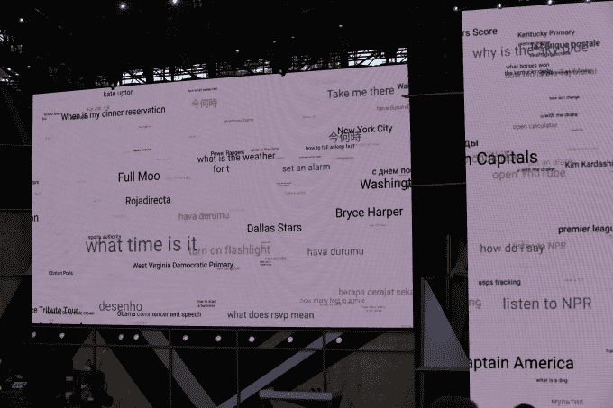

# 谷歌推出虚拟助手 Google Assistant，这是对 Google Now TechCrunch 的重大升级

> 原文：<https://web.archive.org/web/https://techcrunch.com/2016/05/18/google-unveils-google-assistant-a-big-upgrade-to-google-now/>

谷歌今天表示，它将在山景城举行的年度谷歌 I/O 开发者大会上推出一款名为谷歌助手的虚拟助手工具。

这似乎与 Google Now 已经可以做的事情类似，但似乎是它的升级版本。你可以问一个问题来获得答案，然后问多个问题，谷歌会挑选出对话并返回正确的答案。这项服务被整合到其新的对话式用户界面产品中:谷歌助手[也被内置到其新的独立聊天机器人应用](https://web.archive.org/web/20230221080011/https://techcrunch.com/2016/05/18/google-allo-chat-app/)[Allo](https://web.archive.org/web/20230221080011/https://techcrunch.com/2016/05/18/google-unveils-its-amazon-echo-competitor-a-smart-speaker-called-google-home/)以及亚马逊 Echo 的竞争对手谷歌主页中。

“想想这个助手，我们把它当成一个对话助手，我们希望用户有一个持续的双向对话，”首席执行官桑德尔·皮帅说。

谷歌助手似乎也延伸到了聊天领域。用户可以进行查询，Google Assistant 应该能够区分每个问题并返回正确答案。看起来，Google Now 基本上是一个真正智能的聊天机器人。这将是谷歌的一个重要途径，因为服务将目光转向更具对话性的用户界面和人工智能驱动的礼宾服务。

谷歌助手似乎更像是 Alexa 和 Siri 的直接竞争对手，以及 Hound 这样的虚拟助手。这可能表明，谷歌越来越认真地将自己打造成一个虚拟助手，当用户搜索答案时，它可以返回他们需要的任何东西。

这里有一个使用案例:谷歌助理用户可以通过聊天或语音询问谷歌——谁是《地心引力》这样一部电影的导演。然后他们可以问一个问题，比如“他或她还执导过什么电影”，谷歌助手应该能够返回一个答案。谷歌助手还可以执行某些任务，比如更改预约时间或设置日历提醒。

虽然这看起来可能只是对 Google Now 的升级，但这仍然是 Google 的一个重大举措。谷歌希望将其搜索功能扩展到所有类型的设备和界面，无论是类似于脸书 messenger bots 的对话式用户界面，还是 Alexa 这样的语音界面，还是通过谷歌传统搜索引擎进行的标准搜索查询。

皮查伊说:“想象一下在不同设备间延伸的环境体验助手。”“超越手机的计算发展。”

最大的问题是谷歌是否在这场游戏中姗姗来迟。Hound 发布了它的虚拟助手[，它在*非常*令人印象深刻](https://web.archive.org/web/20230221080011/https://techcrunch.com/2016/03/01/hound-a-voice-powered-virtual-assistant-app-launches-publicly/)——脸书正在努力开发自己的虚拟助手应用程序，并为虚拟助手的其他方面建立一个开发平台。谷歌的策略是，它可以利用其强大的人工智能工具和多年来收集的所有数据来建立一个卓越的虚拟助手。谷歌也有自己的名字识别系统。

当谷歌和其他搜索界面扩展到新设备时，谷歌也将不得不寻找新的方法来赚钱。谷歌的“每次点击成本”，实质上是每个广告的价值，在过去几年里一直在下降。该公司试图通过移动设备上的更多查询来弥补这一点，但它仍将不得不开发新的广告产品来继续发展业务。

对话式界面代表了一种新的搜索产品，现在谷歌将不得不考虑如何为其打造一种新的广告产品。幸运的是，谷歌有几十年为搜索开发广告产品的经验，所以在不久的将来，我们很有可能会看到一些新的广告产品。

谷歌今天还推出了 Google Home，这是 Alexa 的竞争对手，为谷歌助手提供环境语音识别界面。随着谷歌继续完善谷歌助手，它将确保继续在所有新界面上扩展其搜索产品，以抵御来自亚马逊(搜索产品)或脸书(搜索人)等专注于个人的搜索产品的竞争。