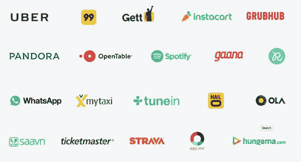

# 谷歌推出其竞争对手亚马逊 Echo，一款名为 Google Home TechCrunch 的智能音箱

> 原文：<https://web.archive.org/web/https://techcrunch.com/2016/05/18/google-unveils-its-amazon-echo-competitor-a-smart-speaker-called-google-home/>

在其年度 I/O 开发者大会上，谷歌今天发布了一款新的硬件设备和亚马逊 Echo 的竞争对手，这是一款由语音辅助技术驱动的便携式扬声器，名为 [Google Home](https://web.archive.org/web/20230221080011/https://home.google.com/) 。该设备是[广为流传的](https://web.archive.org/web/20230221080011/http://www.recode.net/2016/5/11/11658432/google-chirp-amazon-echo-rival)到[一直在开发的](https://web.archive.org/web/20230221080011/https://www.theinformation.com/four-nest-google-products-still-under-wraps?version=meter+at+3&module=meter-Links&pgtype=article&contentId=&mediaId=&referrer=&priority=true&action=click&contentCollection=meter-links-click)，代号为“唧唧”，最终的产品名称最近被《纽约时报》确认为。

**Google Home 功能**

像 Echo 一样，Google Home 也将包括一个虚拟助手，你可以通过语音与之交互。今天早些时候发布的[谷歌助手](https://web.archive.org/web/20230221080011/https://techcrunch.com/2016/05/18/google-unveils-google-assistant-a-big-upgrade-to-google-now/)有点像 Google Now 语音搜索功能的重新命名。然而，新助手能够回答问题，进行双向对话，以及执行播放音乐等任务，与包括 Nest 恒温器在内的智能家居设备进行交互，等等。

这些任务将包括订购鲜花或查询航班等传统上你通过应用程序或网络完成的事情。

谷歌在其语音搜索平台上合作的合作伙伴包括一些著名的名字，如优步、潘多拉、Spotify、OpenTable、Gett、Instacart、Grubhub、Mytaxi、TuneIn、HailO、WhatsApp、Saavn、Ticketmaster 等。(见下文)

然而，与亚马逊 Echo 不同的是，谷歌尚未向所有第三方开发者开放其 Home 平台。它还没有正式宣布 Google Home 的发布合作伙伴。

该公司表示，Google Home Wi-Fi 扬声器将从云中播放音乐和播客，或者你可以通过 Google Cast 将音乐发送到扬声器。这意味着它将不仅限于 Google Play 音乐，还应该支持其他服务，如 Spotify。如果你有一个以上的 Google Home 扬声器，它也可以与其他 Google Home 扬声器配合使用——因为你可以指示它在特定的设备上播放你的音乐。

这款扬声器可以让您定制各种颜色的底座，以匹配家居风格，包括 LED 灯、扬声器和麦克风。对于那些不喜欢亚马逊全黑 Echo 美学的人来说，这是一个很好的功能。

扬声器将于今年晚些时候上市。价格尚未公布。

**家中的谷歌**

今天，谷歌已经拥有了商业中最好的语音识别技术，但是它还没有在家用电器中充分利用这一点。

它的 Nest 恒温器有[语音功能](https://web.archive.org/web/20230221080011/https://techcrunch.com/2014/12/15/the-nest-thermostat-can-now-be-controlled-by-voice/)，但没有[销售势头](https://web.archive.org/web/20230221080011/http://www.recode.net/2016/3/30/11587388/nest-2015-sales-budget)成为真正的主流。然而，不清楚的是，消费者是否对智能恒温器普遍不感兴趣——或许认为它们更像是一种奢侈品——或者他们是否对邀请谷歌进入他们的家庭犹豫不决。

谷歌家庭设备可能会回答这个问题，因为这是谷歌第一次真正努力将其服务套件带入人们的家庭。

虽然它已经推出了其他消费电子产品——命运多舛的 Nexus Q 媒体播放器、在 OEM 硬件上运行的 Android TV 平台、Google Cast(之前的 Chromecast)、OnHub 路由器等等——但没有一个产品将谷歌作为虚拟助手，可以帮助你完成各种生活任务。

“当我走进我的房子，我应该能够与谷歌助理互动，”谷歌产品管理副总裁马里奥·奎罗斯说，他曾在谷歌的另一个热门消费电子产品 Chromecast 上工作。“这就是我们创建 Google Home 的原因。”

**观感**

早期报道称，该设备在外形和简单设计方面将类似于该公司的 [OnHub 无线路由器](https://web.archive.org/web/20230221080011/https://techcrunch.com/2015/08/18/google-launches-onhub-router-promises-faster-wi-fi-and-simpler-setup/)。

当然，OnHub 路由器和现在的 Google Home 看起来都很像亚马逊的 Echo 扬声器，采用黑色圆形设计，外观时尚。然而，Google Home 更小，白色，可定制。

那也是故意的。

亚马逊通过其 Echo speaker 在消费者家中找到了立足点，它可以为你阅读新闻、天气和交通信息，订购和跟踪亚马逊包裹，播放音乐，控制智能家电和照明等。此外，由于名为“技能”的附加软件生态系统不断增长，Echo 也吸引了第三方应用程序开发人员的注意。

今天，通过这些插件，Echo 还可以为你订购披萨或优步，充当你的私人健身教练，为你找到机票，玩游戏等等。

一些业内人士甚至将亚马逊 Echo 称为下一个必备的小工具。

此外，最近的一份分析报告表明，亚马逊[可能已经销售了 300 万台](https://web.archive.org/web/20230221080011/http://www.geekwire.com/2016/report-amazon-sold-3-million-echo-smart-speakers-awareness-grows/)智能扬声器，这部分归功于其在亚马逊网站上的积极推广、大量的假日广告以及其参与亚马逊的销售假日亚马逊优惠日。该公司此后扩大了扬声器的产品线，包括像 Tap 和 Dot 这样的低成本型号的[，并允许开发人员在自己的硬件和应用程序中使用其虚拟助手 Alexa。](https://web.archive.org/web/20230221080011/https://techcrunch.com/2016/03/03/amazon-adds-the-130-tap-and-the-90-dot-to-the-echo-family/)

显然，谷歌已经开始担心了。