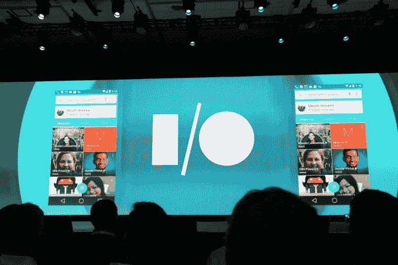
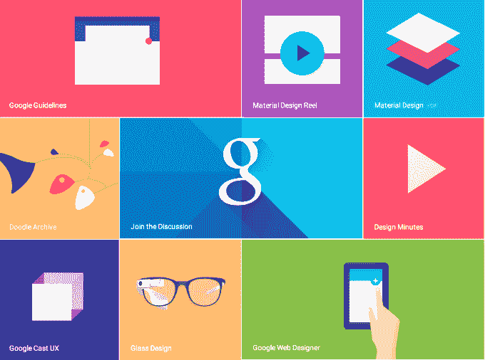

# 谷歌推出新的跨平台设计语言“材料设计”

> 原文：<https://web.archive.org/web/https://techcrunch.com/2014/06/25/google-unveils-new-cross-platform-design-language-material-design/>

谷歌宣布了一种新的通用设计语言，称为材料设计，作为即将发布的谷歌 Android 移动操作系统“L”的一部分。该公司解释说，这种设计旨在为移动设备、平板电脑、台式机和“超越”设备提供更加一致、通用的外观和感觉。

“我们想象…如果像素不仅有颜色，还有深度，会怎么样？如果有一种材料可以改变它的质地呢？谷歌 Android 操作系统用户体验总监马蒂亚斯·杜拉特在今天上午的主题演讲中说:“这让我们想到了我们称之为‘材料设计’的东西。

新设计的一些关键特征包括[系统字体的更新版本 Roboto](https://web.archive.org/web/20230406000542/http://www.google.com/design/spec/style/typography.html) ，以及大胆而富有戏剧性的颜色和高度精美的动画。

Durate 还快速浏览了新框架中的变化，它也将于今天在 google.com/design[公开发布。这个想法是将这个框架放在基于谷歌平台的开发人员手中，这样所有的应用程序都有一致的外观，类似于苹果公司为 Mac 和 iOS 开发人员制定的设计指南。](https://web.archive.org/web/20230406000542/http://www.google.com/design)

该公司还推出了使用这种新语言的谷歌旗舰应用程序的新的重新设计版本，包括 Gmail 和日历，适用于 Android 和网络。你可能记得最近读到过这些变化，当时[的一些博客](https://web.archive.org/web/20230406000542/http://www.geek.com/apps/google-is-testing-new-web-based-gmail-features-1593555/)得到了泄露的 Gmail 重新设计的截屏版本，界面更加简洁明了。

在 Android 上，新的外观被称为“材质”，它支持各种新的动画功能，内置实时 UI 阴影，以及可以在屏幕之间传递的“英雄”元素。

开源框架 [Polymer](https://web.archive.org/web/20230406000542/http://www.polymer-project.org/resources/faq.html) ，在[上一次](https://web.archive.org/web/20230406000542/https://www.youtube.com/watch?v=9pmPa_KxsAM)谷歌 I/O 中被强调，也被认为是开发者创建与这种新设计语言一起工作的构建模块的一种方式。Polymer 提供了一个原型工具，可以让你使用预定义的、可定制的构建模块来构建响应式网站，最近它被讨论为谷歌即将到来的设计变革的一部分[，我们在这里讨论过](https://web.archive.org/web/20230406000542/https://techcrunch.com/2014/06/19/a-sneak-peek-into-androids-future/)，当时它被称为其内部代号“量子纸”。

在谷歌设计网站上，该公司提到其材料设计的目标如下:

*   创造一种视觉语言，将优秀设计的经典原则与技术和科学的创新和可能性结合起来。
*   开发单个底层系统，实现跨平台和设备尺寸的统一体验。移动规则是基础，但触摸、语音、鼠标和键盘都是一流的输入方法。

谷歌将这一新设计描述为“受纸和墨水研究的启发，但技术先进，并对想象力和魔法开放。”

谷歌表示，该设计使用熟悉的触觉方式与其许多部分进行交互，并带有基于现实的视觉提示。它的元素也让人想起基于印刷的设计排版，“深思熟虑的颜色选择、边缘到边缘的图像、大规模排版和有意的空白创造了一个大胆的图形界面，让用户沉浸在体验中。”

运动是设计的另一个关键元素，但也是必须的。“动作是有意义和恰当的，有助于集中注意力和保持连续性，”谷歌补充道。

更广泛地说，设计更新是为了让最终用户更愉快地使用谷歌的产品和服务，包括 Android。众所周知，苹果对其开发合作伙伴有更严格的设计准则，这有助于塑造消费者对苹果的看法，即苹果是一家专注于设计的公司。

现在，谷歌正加紧表明，它也准备好了在设计上展开竞争。

此举正值苹果也进入谷歌主导的领域——如云服务。消息人士称，这让谷歌感到担忧，因为看起来苹果在基础设施方面比谷歌在设计方面做得更好。材料设计是谷歌改变这种状况的努力。

【YouTube https://www.youtube.com/watch?v=Q8TXgCzxEnw&w=640&h=390]

*更新…*