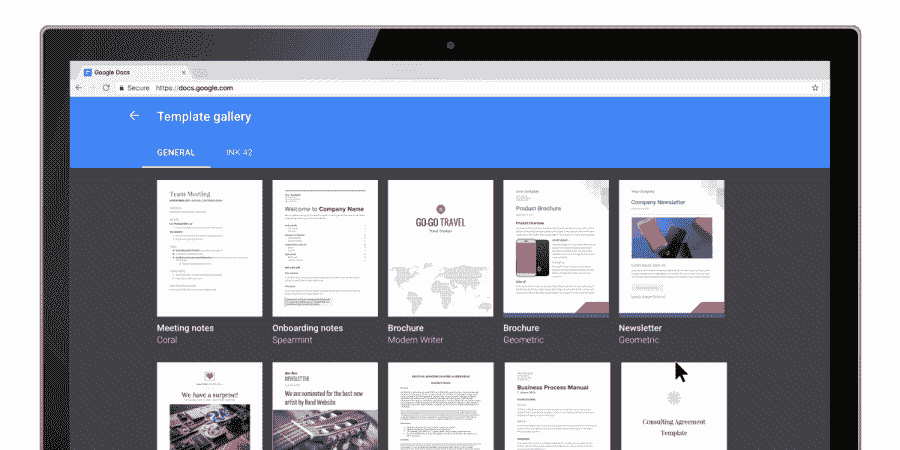

# Google 使用新的协作功能更新文档、表格和幻灯片 

> 原文：<https://web.archive.org/web/https://techcrunch.com/2017/08/16/google-updates-docs-sheets-and-slides-with-new-collaboration-features/>

# 谷歌用新的协作功能更新文档、表格和幻灯片

谷歌的在线生产力工具套件 G Suite(T1)今天在 T2 进行了重大更新，为谷歌文档、表格和幻灯片增加了许多新功能。这些更新大多围绕着协作，但该服务也获得了对谷歌云搜索的支持，该公司正在添加新的模板和来自 LegalZoom、DocuSign、LucidChart 等合作伙伴的插件。

回到[黑暗时代](https://web.archive.org/web/20221209101127/https://en.wikipedia.org/wiki/Early_Middle_Ages)，人们过去常常通过电子邮件共享文档，为了确保每个人都在同一页面上，他们会为不同版本的 Word 或 Excel 文档更改文件名。在很大程度上，这真的不再需要了，但是有了这个更新，Google Docs Sheets 和 Slides 现在可以通过用不同的名称保存一个文档的多个版本来跟踪更改。公平地说，每当您想要保存文档的规范版本时，这可能是有用的，尽管我不确定这是否是最受欢迎的 G Suite 特性中最重要的。

在文档和幻灯片中与 [Google Cloud Search](https://web.archive.org/web/20221209101127/https://gsuite.google.com/products/cloud-search/) 的新集成意味着 G Suite 业务和企业用户现在将能够从他们的内部文档中快速找到正确的信息，而不必离开编辑器。以前，你必须专门去云搜索寻找文档，但现在你可以直接从文档和幻灯片中开始搜索。

此外，这个版本中的新功能是能够在 Docs 中看到一个干净的文件版本，没有任何评论或编辑，但如果你想快速处理所有编辑的建议，现在只需单击一下就可以接受或拒绝所有建议。此外，借助新的 Litera Change-Pro 和 Workshare 附加组件 for Docs，您现在还可以更轻松地比较 Docs 中的文档。

对于移动用户来说，这一更新还带来了在 Android 和 iOS 上建议更改的能力，这是早期版本中非常缺乏的。

