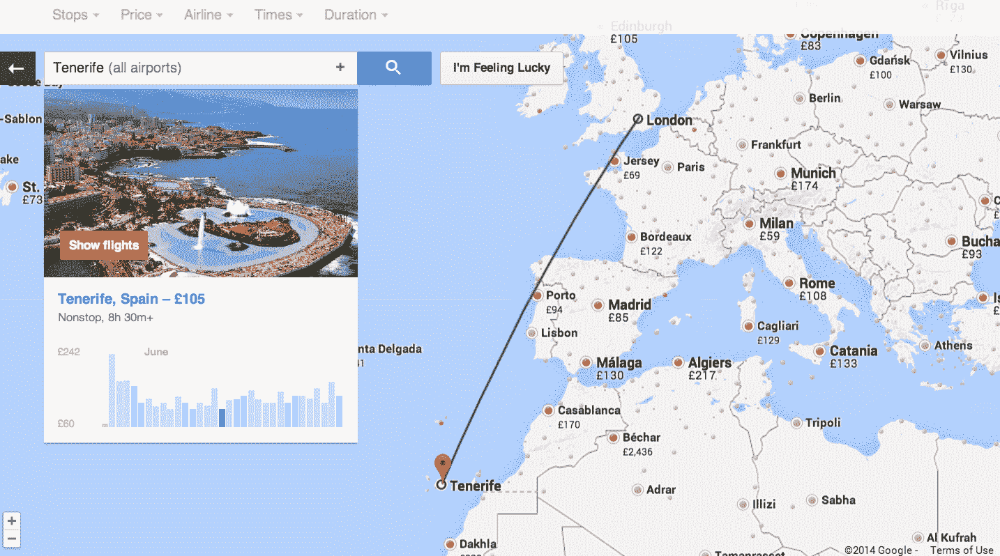

# 谷歌用新的搜索选项更新航班搜索，“我感觉很幸运”按钮 

> 原文：<https://web.archive.org/web/https://techcrunch.com/2014/06/11/google-updates-flight-search-with-new-search-options-im-feeling-lucky-button/>

# 谷歌用新的搜索选项更新航班搜索，“我感觉很幸运”按钮

[https://www.youtube.com/watch?v=-hffP2vr1Jk](https://web.archive.org/web/20221002221346/https://www.youtube.com/watch?v=-hffP2vr1Jk)

谷歌正在用一些新工具更新其[航班搜索功能](https://web.archive.org/web/20221002221346/https://www.google.com/flights/)。大多数都是围绕在给定的预算内寻找潜在的旅行，甚至包括谷歌标志性的“我感觉很幸运”按钮的回归。

大约一年前，谷歌推出了一项实验性功能，在地图上突出显示特定地区目的地的票价。从今天开始，它将这个滚动到主航班搜索界面。比方说，你正在寻找一次加勒比海之旅，并且对你想去的地方非常灵活。有了这个功能，你只需放大地图，看看飞往不同岛屿的航班费用。也许现在飞往圣马丁的机票很贵，但是由于机票价格的变化无常，去阿鲁巴岛旅行会便宜很多。

这种搜索的一个好处是，你仍然可以根据价格、飞行时间、航空公司联盟和经停次数进行过滤。如果你心中有一个特定的地区或国家，你也可以使用标准的谷歌航班搜索引擎，并将它们作为你的目的地，而不是特定的城市或机场。

如果你完全不知道你想去哪里，只是需要一些灵感，航班搜索地图也有一个“我感觉很幸运”按钮——就像去年的谷歌搜索一样。只要给它一个价格或时间限制，它就会为你建议一个目的地。

其他新功能包括个性化的——高度可视化的——潜在目的地列表，就在航班搜索主页上，现在还会突出显示您以前的搜索。

当然，谷歌并不是唯一提供这些功能的航班搜索引擎。例如，Kayak 提供了类似的基于地图的视图。然而，一直让谷歌航班搜索脱颖而出的是谷歌显示价格的速度。谷歌会花一两秒钟给你你的价格，而不是相对漫长的等待。到目前为止，这一直是谷歌的一大优势，但即便如此，航班搜索大多都没有引起人们的注意。随着这些新功能的出现，这种情况可能会有所改变。