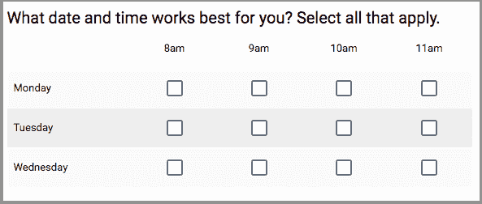

# Google 通过智能响应验证、跨域上传等功能更新表单

> 原文：<https://web.archive.org/web/https://techcrunch.com/2017/07/10/google-updates-forms-with-intelligent-response-validation-cross-domain-uploads-and-more/>

# Google 通过智能响应验证、跨域上传等功能更新表单

谷歌今天[宣布](https://web.archive.org/web/20230404114953/https://gsuiteupdates.googleblog.com/2017/07/new-features-in-google-forms.html)对[表单](https://web.archive.org/web/20230404114953/https://www.google.com/forms/about/)进行更新，这是一项建立在线调查以收集信息的服务。现在，无论你是想知道谁会真正想来参加你在当地 ropes 课程的团队建设活动，还是你的客户对你的最新产品有什么看法，表格都会更有用一些。

新特性之一是智能响应验证，它会自动为您的各种字段建议正确的响应验证。例如，如果你需要一个电子邮件地址，表格会建议你选择名副其实的“只接受电子邮件”选项。这同样适用于网址、年龄和类似的领域。

表单用户现在也可以请求公司以外的用户上传文件——但前提是你的公司和你的受访者的公司都允许在 Google Drive 中进行[跨域文件共享。上传到新表单的上限现在是 1GB，这对于大多数用例来说可能足够了，但是用户也可以将这个限制增加到 1TB(这也是现有表单的上限)。](https://web.archive.org/web/20230404114953/https://support.google.com/a/answer/60781)

谷歌还引入了一种新的问题类型:复选框网格。这允许回答者从表格中的多个选项中进行选择。举例来说，如果你想找到一个好的会议时间，那就太好了，毕竟，这是一个即使我们在机器学习方面的所有进步都无法解决的问题。

表单中新增的设置可以应用到所有新表单中。例如，有了这个，你可以选择总是收集电子邮件地址。用户现在只需点击几下鼠标就可以对他们的章节进行重新排序。

这些新功能现在可以在快速发布渠道获得，并将在两周内提供给所有用户。