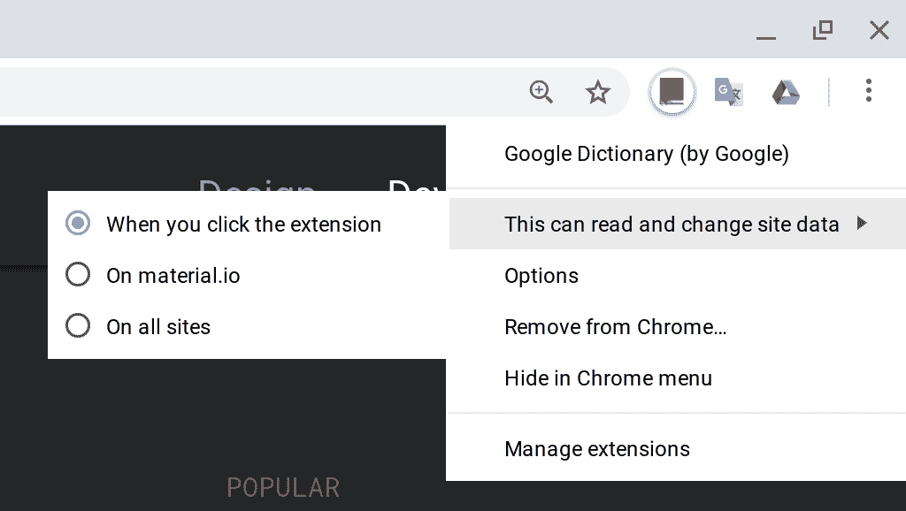

# 谷歌希望让 Chrome 扩展更安全 

> 原文：<https://web.archive.org/web/https://techcrunch.com/2018/10/01/google-wants-to-make-chrome-extensions-safer/>

谷歌今天宣布了 Chrome 将如何处理请求大量权限的扩展的一些即将到来的变化，以及对希望在 [Chrome 网络商店](https://web.archive.org/web/20221025222446/https://chrome.google.com/webstore/category/extensions)发布其扩展的开发者的新要求。

众所周知，无论您使用哪种浏览器，扩展都是恶意开发人员获取数据的主要途径之一。多年来，谷歌已经提高了在恶意扩展进入商店之前自动检测它们的能力。该公司还对浏览器本身做了一些相当[的改动](https://web.archive.org/web/20221025222446/https://blog.chromium.org/2018/06/improving-extension-transparency-for.html)，以确保扩展一旦被安装就能造成严重破坏。现在，它更进一步。

从 Chrome 70 开始，用户可以[限制主机访问](https://web.archive.org/web/20221025222446/https://developer.chrome.com/extensions/runtime_host_permissions)他们自己定制的网站列表。这一点很重要，因为默认情况下，大多数扩展可以看到和操作你访问的任何网站。然而，白名单很难维护，所以用户也可以选择只提供一个点击后就可以访问当前页面的扩展。

“虽然主机权限已经实现了数千个强大而有创意的扩展用例，但它们也导致了广泛的滥用——既有恶意的，也有无意的——因为它们允许扩展自动读取和更改网站上的数据，”谷歌在今天的公告中解释道。

任何申请谷歌所谓的“强大权限”的扩展现在也将受到更广泛的审查。此外，谷歌还将进一步研究使用远程托管代码的扩展(毕竟，代码可能随时被更改)。

就权限而言，谷歌还指出，在 2019 年，它将引入新的机制和更窄范围的 API，这将减少对更广泛权限的需求，并让用户能够更多地控制他们授予其扩展的访问权限。从 2019 年开始，谷歌还将要求对 Chrome 网络商店开发者账户的访问进行双因素认证，以确保恶意行为者无法接管开发者的账户并发布被黑客攻击的扩展。

虽然这种改变还有几个月的时间，但从今天开始，开发者不再被允许发布带有[混淆代码](https://web.archive.org/web/20221025222446/https://en.wikipedia.org/wiki/Obfuscation_(software))的扩展。默认情况下，模糊代码并不是一件坏事。开发人员经常使用这种扰乱 JavaScript 源代码的方法来隐藏他们的代码，否则这些代码就会以明文形式出现，很容易被窃取。这也使得很难弄清楚这些代码到底是做什么的，70%的恶意扩展和那些试图规避谷歌政策的扩展使用模糊代码。谷歌将在 90 天内删除所有带有混淆代码的现有扩展。

值得注意的是，开发者仍然被允许缩减他们的代码，例如删除空白、注释和换行符。