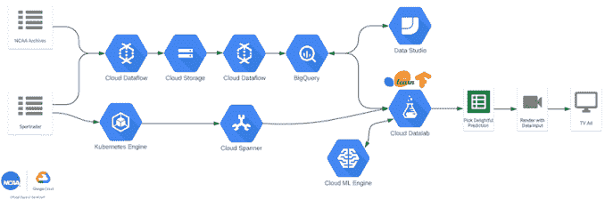

# 谷歌将在本周末进行实时的四大预测，并在中场电视广告中播出

> 原文：<https://web.archive.org/web/https://techcrunch.com/2018/03/30/google-will-make-real-time-final-four-predictions-this-weekend-air-them-as-halftime-tv-ads/>

# 谷歌将在本周末进行实时的四强预测，并在半场电视广告中播出

谷歌希望实时检验其数据科学能力。本周末，该公司将在圣安东尼奥举行的[四强赛中使用数据分析技术和机器学习来弄清楚它认为现场比赛中接下来会发生什么。在此之后，它将发布对比赛下半场的预测，作为半场电视广告播出。](https://web.archive.org/web/20230307142252/https://www.ncaa.com/march-madness-live/watch)

该公司今天早上在[的一篇博客文章](https://web.archive.org/web/20230307142252/https://www.blog.google/topics/google-cloud/how-were-using-predictive-analytics-during-final-four/)中详细介绍了其计划，解释了这个想法是如何从[与 NCAA 的现有关系](https://web.archive.org/web/20230307142252/https://www.blog.google/topics/google-cloud/ncaa-teams-google-cloud/)中产生的，涉及使用谷歌的云技术进行统计游戏和竞争数据分析。然后，谷歌决定进一步挑战自己，看看它还能利用 NCAA 的数据做些什么。

组建了一个包括数据科学家、技术人员和篮球爱好者在内的团队，谷歌使用谷歌云平台和 BigQuery 和 Cloud Datalab 等技术建立了一个数据处理工作流程。它能够揭示各种各样的见解，比如谁每分钟盖帽最多，或者拥有动物吉祥物的球队是否会引起更多的不安。然后谷歌决定尝试预测现场比赛中会发生什么。

本周末，它将实时分析最后四场比赛上半场的数据，并在几分钟内将预测转化为电视广告。

其工作方式是，谷歌云团队将在奥运会期间出现在现场，并将上半年的数据输入其工作流程，并根据 NCAA 的历史数据进行分析。当中场休息开始时，团队将处理数据并提出预测。关于其工作流程的技术团队已经在谷歌云大数据和机器学习博客上分享了[。](https://web.archive.org/web/20230307142252/https://cloud.google.com/blog/big-data/2018/03/architecting-live-ncaa-predictions-from-archives-to-insights)

半场结束前，谷歌将向哥伦比亚广播公司和特纳移交一个新制作的电视广告，该广告将在下半场开始前播出。

“这可能是一家公司首次在电视直播的体育赛事中使用自己的实时预测分析制作广告，”谷歌指出。

这项实验是宣传谷歌云和其他技术的一种聪明方式，但它不是唯一一家进行最后四项预测的科技公司。

所有的虚拟助手也在做出自己的预测，包括谷歌自己的谷歌助手、Alexa、Cortana 和 Siri。但他们的答案有时更像是编辑意见，而不是真正的数据科学。

你可以在专门的网站[cloud.withgoogle.com/ncaa](https://web.archive.org/web/20230307142252/https://cloud.withgoogle.com/ncaa/)上跟踪谷歌的 NCAA 实验。