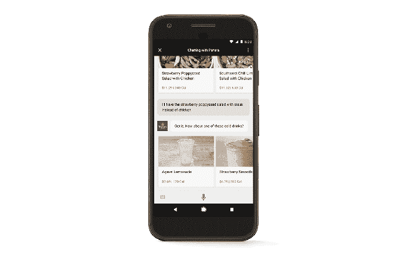

# 谷歌现在将允许用户用任何一张有记录的卡支付，而不仅仅是那些保存在 Android Pay  中的卡

> 原文：<https://web.archive.org/web/https://techcrunch.com/2017/05/17/google-will-now-let-users-pay-with-any-card-they-have-on-file-not-just-those-saved-in-android-pay/>

# 谷歌现在将允许用户用任何一张有记录的卡支付，而不仅仅是那些保存在 Android Pay 中的卡

谷歌今天[让用户外出时在第三方应用和移动网站以及谷歌助手中进行支付变得更加容易](https://web.archive.org/web/20230227122902/https://adwords.googleblog.com/2017/05/google-io.html)。该公司将不再依赖用户希望用来支付的卡预装在 Android Pay 中——他们将能够从他们之前在谷歌账户中使用的任何支付卡中进行选择。

该公司表示，它正在通过其[谷歌支付 API](https://web.archive.org/web/20230227122902/https://www.google.com/payments/solutions/?utm_source=payments&utm_medium=blog&utm_campaign=io2017pay) 扩展这种支付选项，该工具允许商家和开发者在自己的网站和应用程序中集成支付。

此举是有道理的，因为 Android Pay 正在努力与竞争对手 Apple Pay 竞争。正如 4 月份的一份报告指出的那样，Apple Pay 拥有 8600 万用户，而 Android Pay 只有 2400 万用户。

然而，谷歌本身已经通过各种服务收集了客户的支付卡数据，包括 Play Store、谷歌商店、YouTube，甚至存储在其 Chrome 网络浏览器中。通过允许用户选择这些已保存的支付方式中的一种，而不是 Android Pay，用户将更容易进行支付——例如，他们不必在公共场合掏出支付卡，或者花时间重新输入谷歌已经存档的数据。

对于开发者来说，谷歌承诺这一变化将带来更快的结账速度、更多的转化率、更少的购物车废弃率和更高的销售额。

更多详情在支付 API 网站[这里](https://web.archive.org/web/20230227122902/https://www.google.com/payments/solutions/?utm_source=payments&utm_medium=blog&utm_campaign=io2017pay)。