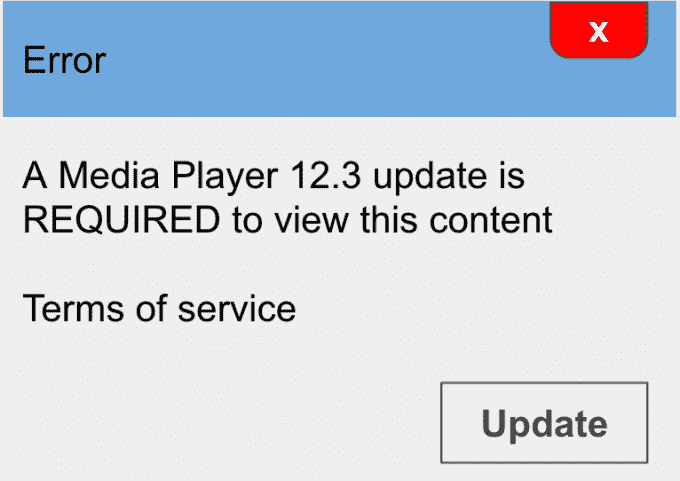

# 现在，当网站上出现欺骗性的“社会工程”广告时，谷歌会向用户发出警告

> 原文：<https://web.archive.org/web/https://techcrunch.com/2016/04/12/google-will-now-warn-users-when-websites-host-deceptive-social-engineering-ads/>

*【更新:谷歌今天[在其企业博客](https://web.archive.org/web/20221217045736/https://security.googleblog.com/2016/02/no-more-deceptive-download-buttons.html)上发布了这一消息，但这是今年早些时候宣布的[。我们已经要求谷歌澄清为什么重新发布，如果这是错误的，或者它是否代表了自第一次发布以来的任何变化。]](https://web.archive.org/web/20221217045736/https://security.googleblog.com/2016/02/no-more-deceptive-download-buttons.html)*

谷歌表示，通过更新其“安全浏览”倡议，它正在扩大努力，以更好地保护网络冲浪者免受网上欺骗性内容的侵害。当用户遇到谷歌称之为“社会工程”广告的网站时，这个搜索巨头将会标记并警告用户。这些广告试图欺骗用户，让他们认为他们收到了来自可信实体的消息，例如网络浏览器通知、软件更新、电脑错误信息或网站本身。

展望未来，谷歌表示，运行这些类型的广告或托管这些内容的网站现在将被谷歌标记，访问者将被警告不要继续前进。

如果你以前遇到过谷歌的“安全浏览”警告信息(见上图)，你知道他们做得很好。不是将访问者直接带到有问题的网站，而是出现一个红色的错误页面，通知网络冲浪者为什么他们不想继续。这些信息会提示用户点击“返回安全”按钮，但不会完全阻止那些决定继续的用户访问网站。

过去，谷歌曾使用警告信息切断恶意软件网站的流量，或[参与网络钓鱼攻击](https://web.archive.org/web/20221217045736/https://support.google.com/websearch/answer/106318?hl=en&rd=1)，等等。

去年 11 月，谷歌[宣布](https://web.archive.org/web/20221217045736/https://security.googleblog.com/2015/11/safe-browsing-protection-from-even-more.html)它正在扩展其安全浏览程序，以抵御社会工程“攻击”。这意味着当这些相同的策略被用来欺骗用户安装恶意软件或泄露个人信息时，它开始警告用户。随着今天的变化，这些保护正在扩大，也包括广告。

你可能对这类“广告”很熟悉有些人声称你运行的一些软件已经过时或需要更新，但实际上是试图欺骗用户安装新的、不需要的程序。

还有一些伪装成“下载”或“播放”按钮，好像点击它们就能获得用户想要的视频内容或视频流。这通常是非法在线视频服务网站的问题，随着越来越多的消费者切断与传统电视的联系，这些网站越来越受欢迎。

这些广告和嵌入内容有时很难识别，即使是精明的网络用户也很难识别，因为它们通常被设计成无法与网站的其他内容区分开来。也就是说，它们看起来像是网站功能本身的一部分。

谷歌现在将对使用这些策略的网站或与使用这些策略的广告商合作的网站发出警告。它表示，假装“像一个受信任的实体一样行动、看起来和感觉”的内容将被视为社会工程内容，以及任何试图欺骗用户做一些他们通常只会为受信任的实体做的事情的内容，如共享密码或致电技术支持。

在谷歌的标志和警告何时应用于带有这些广告的网站方面，似乎有一些回旋余地。目标是打击那些经常从事欺骗性广告的实体，而不是惩罚流氓广告可能潜入的网站，例如通过广告网络。据谷歌称，受影响的网站将是那些访问者“持续看到社会工程内容”的网站。

****更新**:谷歌表示，目前还不确定这些内容是如何被再次发布到其公司博客上的，并正在对此进行调查。这个消息是之前公布的。*