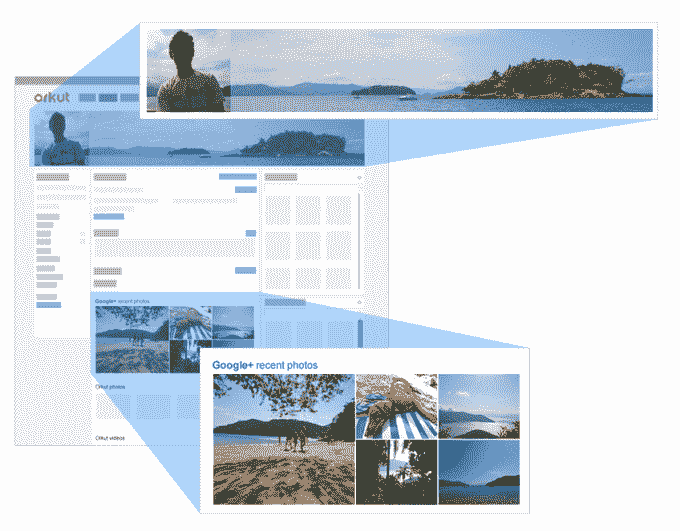

# 谷歌将于 9 月关闭其 Orkut 社交网络 

> 原文：<https://web.archive.org/web/https://techcrunch.com/2014/06/30/google-will-shut-down-its-orkut-social-network-in-september/>

谷歌早在 2004 年推出的社交网络服务 Orkut 奇迹般地通过了多轮春季大扫除，尽管它在巴西、印度和其他几个国家之外从未大受欢迎。然而，谷歌关闭它只是时间问题，这一天[现在来了](https://web.archive.org/web/20230129060435/http://en.blog.orkut.com/2014/06/tchau-orkut.html)。

2014 年 9 月 30 日，Orkut 将正式关闭。到那时，用户将无法登录，照片导出到 Google+将不可用，所有的 API 和其他工具也将关闭。

然而，直到 2016 年 9 月，Orkut 爱好者仍将[能够](https://web.archive.org/web/20230129060435/https://support.google.com/orkut/answer/6033100?p=orkut&hl=en&rd=1)使用[谷歌外卖](https://web.archive.org/web/20230129060435/https://www.google.com/settings/takeout)导出他们所有的数据。如果你还想看看 Orkut 是怎么回事，但是你还没有一个帐户，现在这么做已经太晚了。新帐户的注册已被禁用。

Orkut 是谷歌推出社交网络的首批尝试之一。它从未在美国流行起来，但它确实在巴西等国家找到了自己的位置，至少在一段时间内，它是最受欢迎的社交网络。例如，直到 2012 年，脸书才最终在那里超越了它。在印度，Orkut 没能坚持那么久。在那里，它在 2010 年落到了脸书手中。

今天，50%的 Orkut 用户仍然在巴西，20%在印度，不到 18%来自美国

就积极开发而言，看起来大部分都在 2012 年左右停止了。该网站仍然以谷歌的旧菜单栏为特色，看起来 Google Talk 也没有得到任何升级。在所有这些忽视之后，该网站现在看起来肯定有点过时了，所以难怪谷歌现在希望用户转而使用 Google+。

对于一开始只有 20%项目的谷歌服务来说，这是一个不错的记录，但谷歌表示，随着 YouTube、Blogger 和 Google+的起飞(尽管有些人可能会对 Google+的成功提出质疑)，“这些社区的增长超过了 Orkut 的增长。”谷歌表示，它希望将“精力和资源集中在让这些其他社交平台尽可能地为每个用户带来惊喜上。”