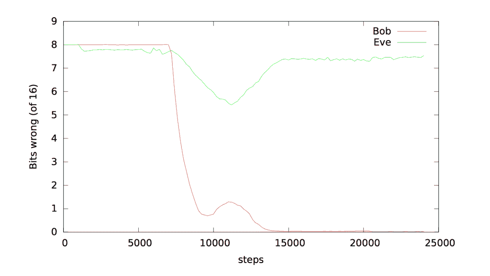

# 谷歌的人工智能创造了自己的非人加密技术 

> 原文：<https://web.archive.org/web/https://techcrunch.com/2016/10/28/googles-ai-creates-its-own-inhuman-encryption/>

# 谷歌的人工智能创造了自己不人道的加密技术

当你让两台智能计算机秘密地相互对话，并让另一台人工智能去打破这种对话时，会发生什么？你得到了我所见过的最酷的密码学实验之一。

简而言之，谷歌大脑的研究人员已经发现，人工智能在适当的任务下，会创造出奇怪的非人类密码方案，而且它们更擅长加密而不是解密。这篇名为“学习用对抗性神经加密技术保护通信”的论文[可以在这里](https://web.archive.org/web/20221209033526/https://arxiv.org/pdf/1610.06918v1.pdf)找到。

这项任务的规则很简单。Bob 和 Alice 这两个神经网络共享一个密钥。另一个神经网络 Eve 的任务是读取两个机器人之间的通信。每一方都有一个条件，一个“损失函数”。Eve 和接收者 Bob 的明文必须尽可能接近原始明文，而 Alice 的损失函数取决于 Eve 的猜测与随机猜测的差距。这在机器人之间创造了一个生殖对抗网络。

研究人员马丁·阿巴迪和大卫·g·安德森写道:

Informally，与会者的目标如下。Eve 的目标很简单:精确重构 P(换句话说，最小化 P 和 PEve 之间的误差)。Alice 和 Bob 想要清楚地通信(以最小化 P 和 PBob 之间的误差)，但是也对 Eve 隐藏他们的通信。注意，根据现代密码定义(例如，(Goldwasser & Micali，1984))，我们不要求密文 C 对 Eve“看起来是随机的”。密文甚至可能包含明显的元数据来标识它。因此，Eve 的目标不是将 C 与从某个分布中抽取的随机值区分开来。在这方面，Eve 的目标与 GANs 的对手的目标形成了鲜明的对比。另一方面，我们可以尝试重新表述 Eve 的目标，区分由两个不同的明文构造的密文。

这些方法随着时间的推移不断发展，最终 Bob 和 Alice 能够使用共享密钥进行清晰的通信。另一方面，伊芙在解密系统时运气不错，直到鲍勃和爱丽丝变得熟练了，她破解密码的能力才失效。另一方面，Bob 和 Alice 非常擅长共享加密信息，他们的许多技术非常奇怪和出人意料，依赖于在“人类生成的”加密中不常见的计算。

最终，研究人员发现，只要重视安全性，Bob 和 Alice 擅长自己设计一个可靠的加密协议。另一方面，伊芙花了很多时间解密他们的通讯。这意味着机器人将能够以我们或其他机器人无法破解的方式相互交流。就我而言，欢迎我们的机器人密码霸主。