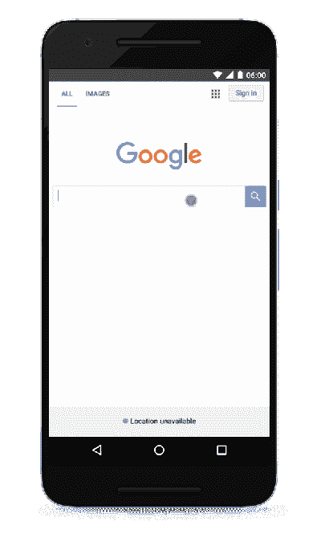

# 谷歌的 AMP 项目超越新闻 

> 原文：<https://web.archive.org/web/https://techcrunch.com/2016/08/02/googles-amp-expands-beyond-news/>

 在[为其移动搜索结果中的新闻故事推出](https://web.archive.org/web/20221102060319/https://beta.techcrunch.com/2016/02/24/google-now-highlights-amp-pages-in-its-mobile-search-results/) [AMP](https://web.archive.org/web/20221102060319/https://www.ampproject.org/) 六个月后，谷歌今天宣布了该项目的下一步:将 AMP 从新闻转移到其他移动网站。

 就像新闻网站 AMP 页面的推出一样，谷歌今天将推出[一个演示网站](https://web.archive.org/web/20221102060319/http://g.co/ampdemo)，它将允许你测试这种体验，并让开发者有机会在向所有用户推出这一功能之前微调 [AMP 对他们网站的支持](https://web.archive.org/web/20221102060319/https://www.ampproject.org/docs/get_started/about-amp.html)。

AMP 团队的产品经理 Rudy Galfi 告诉我，该团队认为，在为新闻网站成功推出 AMP 之后，它现在“准备好了更多”

谷歌的索引中已经有超过 650，000 个域的超过 1.5 亿份 AMP 文档，正如 Galfi 告诉我的那样，该公司已经看到许多非新闻网站也采用了这种格式，尽管这些页面还不容易被用户使用。

早在 6 月份，谷歌就与易贝合作，为该公司的移动页面提供 AMP 支持，但新的演示网站提供了 Squarespace、Reddit、Flipkart、猫途鹰、迪士尼、Genius、Food Network、Instructables、Drugs.com、NFL 等公司的 AMP 页面。例如，如果你在演示网站上搜索“[纸牌魔术](https://web.archive.org/web/20221102060319/https://www.google.com/search?esrch=AcceleratedMobilePages%3A%3APreview%2CAcceleratedMobilePagesDesktop%3A%3APromo&site=webhp&ei=C8SgV5KKDcmOjwO1lKm4Ag&q=card+tricks&oq=card+tricks&gs_l=mobile-gws-serp.12..0j0i131j0j0i20j0.48367.51179.0.51812.13.12.1.7.7.0.185.1501.0j11.11.0....0...1c.1j4.64.mobile-gws-serp..1.12.776.3..35i39j0i67.tNaOVtlxFJk)，你可能会看到一些 Instructables 的即时加载结果，旁边有标准的 AMP 闪电符号。歌词、菜谱等内容也是如此。

虽然 AMP 的早期工作主要集中在新闻网站上，但这种格式本身也适用于其他类型的内容。不过，该团队仍在努力为电子商务网站提供更好的支持，例如，如何更好地处理表单。

AMP 页面目前的平均加载速度是非 AMP 页面的四倍。平均加载时间不到一秒。Galfi 强调，这里没有排名变化，所以有 AMP 页面不应该改变一个页面在搜索结果页面上的排名。不过，作为一名用户，当我在搜索结果中看到一个 AMP 页面时，我更倾向于点击它，而不是非 AMP 页面。毕竟，在这一点上，大多数移动网站充斥着缓慢加载的广告(甚至可能是路障广告)。虽然 AMP 支持广告(和付费墙)，但这些广告的加载速度要快得多，而且不会真正中断浏览体验。

谷歌发言人告诉我，谷歌移动搜索结果中对非新闻网站的 AMP 支持应该会在未来几个月内在预览网站之外推出，但目前还没有明确的时间框架。如果你想尝试一下预演，就去 g.co/ampdemo 的[用移动设备搜索一些泰勒·斯威夫特的歌词。](https://web.archive.org/web/20221102060319/http://g.co/ampdemo)