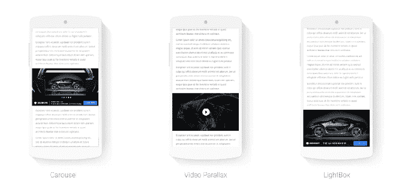

# Google 的 AMP 现在支持 2B+移动页面和 90 万个域名，加载速度提高 2 倍

> 原文：<https://web.archive.org/web/https://techcrunch.com/2017/05/18/googles-amp-now-powers-2b-mobile-pages-and-900k-domains-loads-2x-faster/>

随着谷歌寻找方法让人们使用自己的移动搜索来发现内容——与脸书的即时文章等应用和其他服务竞争——该公司宣布对其合作项目 AMP 进行一些更新，以加快移动网页的速度。

今天在谷歌 I/O 开发者大会上，谷歌宣布现在有超过 20 亿个 AMP 页面，覆盖大约 90 万个域。通过谷歌搜索，这些页面的加载速度也是以前的两倍。最后，AMP 网络现在正扩展到更多的电子商务网站和覆盖更多广告形式的。

这些进步抵消了一些争议，谷歌和其他公司通过类似这样的举措来吸引这些争议，这些举措针对用户体验进行了优化，但受到了[的批评](https://web.archive.org/web/20230306035636/http://www.techmeme.com/161023/p3#a161023p3),因为它将人们基本上引向谷歌/脸书/其他域名，因此从网站本身带走了流量。

在 WordPress 上发布的一篇宣布这一消息的博客文章中，可能是为了强调谷歌是如何试图展示这是一项跨公司的协作举措？—谷歌从亚马逊统计学院(Amazon school of stats)获取了一个页面，并拒绝透露通过谷歌搜索用 AMP(加速移动页面的缩写)编码的 HTML 页面的实际页面加载时间。

但它指出，改进来自后端所做的改变，特别是 AMP 缓存，减少了 50%的图像带宽；并实现了一种新的压缩算法，名为 [Brotli](https://web.archive.org/web/20230306035636/https://opensource.googleblog.com/2015/09/introducing-brotli-new-compression.html) ，这是谷歌在 2015 年宣布的，可以将文档大小减少 10%。

与此同时，随着一些专注于社交网络的最新网站的加入，支持 AMP 的网站列表现在已经有了很大的提升。

Tumblr(归雅虎所有，其搜索引擎指向 AMP 页面)现在正在推动 3.4 亿个博客和 50 万个域在移动设备上呈现在 AMP 中。Twitter 现在也链接到移动网络中的 AMP 页面(当你点击推文中的链接时)，并计划很快将 AMP 链接扩展到其移动应用程序。

在亚洲，腾讯的 Qzone(中国最大的社交网络)和微博(第三大)现在也使用 AMP 渲染移动页面。

既然谷歌已经建立了 AMP 如何在大范围的页面上工作的基础，看起来它正在加速它在 AMP 上的商业运作。

具体来说，它增加了使用这种格式的电子商务页面的数量，也扩大了 AMP pages 将支持的广告单元的数量。

电子商务的扩张包括易贝，它在大约一年前首次在大约 1500 万个页面[上引入 AMP 支持，现在正在扩展到](https://web.archive.org/web/20230306035636/http://www.ebaytechblog.com/2016/06/30/browse-ebay-with-style-and-speed/)[数百万个页面](https://web.archive.org/web/20230306035636/https://www.ebayinc.com/stories/news/ebay-speeds-up-mobile-experiences-by-expanding-amp-technology-for-product-pages/)，包括其所有的产品页面，特别关注添加品牌和“兴趣”页面，旨在为用户提供更有针对性的结果，而不是你在网站上可能会看到的大杂烩。

其他加入 AMP 的公司包括欧洲的 Zalando、印度的 Myntra 和中国的全球速卖通。

与此同时，ads 计划将与一般页面加载时间相同的原则应用于广告的概念。具体来说，今天谷歌推出了三种新的广告格式编码:

这一点很重要，因为网页在网络上停滞不前的一个主要原因是广告和伴随它们的大量臃肿软件，它们用来衡量我们做了什么。

这导致许多人使用广告拦截器或类似 Opera 的浏览器来拦截广告。

对于像谷歌这样的公司来说，其主要业务是在线广告，这是一个令人担忧的趋势，因此毫不奇怪，它改善移动用户体验的努力已经转向改善移动广告用户体验。

当然，通过为这些新的广告格式编写代码，它也将自己置于这些广告将如何实现的中间，使谷歌在下一代移动网络将如何赚钱的谈判中获得持续的一席之地。