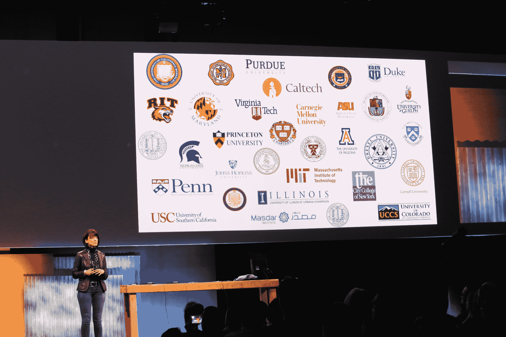

# 谷歌的 ATAP 希望永久取消密码 

> 原文：<https://web.archive.org/web/https://techcrunch.com/2015/05/29/googles-atap-wants-to-eliminate-passwords-for-good/>

# 谷歌的 ATAP 希望永远消除密码

谷歌的高级研究部门 ATAP 今天在该公司的 I/O 开发者大会上展示了一个新项目，旨在用一个新系统取代手机密码，该系统可以在一天中观察你的打字模式和其他信号。

这里的想法是将 pin 和密码的负担从用户转移到设备上，这将在你一天中不断生成信任分数，以确保你确实是使用它的人。

ATAP 首席执行官 Regina Dugan 今天解释说，该团队查看了关于该主题的现有研究，但没有一个学术机构能够创建一个甚至像四位 PIN 码一样安全的系统。

为了改善这一点，谷歌与许多大学合作，邀请了来自 16 个机构的 25 名专家来谷歌参加为期 90 天的密集研究冲刺。该团队收集了 1500 名捐赠者的数据，并得出结论，新系统现在比指纹系统安全 10 倍。

如果这是真的，那么这确实是一项重大成就，并且可能很快取代现有的安全机制。不过，当你登录银行的移动应用程序时，你可能仍想使用双重身份认证。实现这一点所需要的只是软件更新，因此 ATAP 希望它能够在未来将这一系统带到数百万部 Android 手机上。

