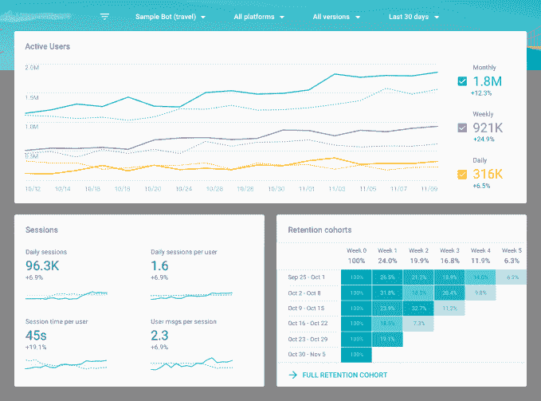
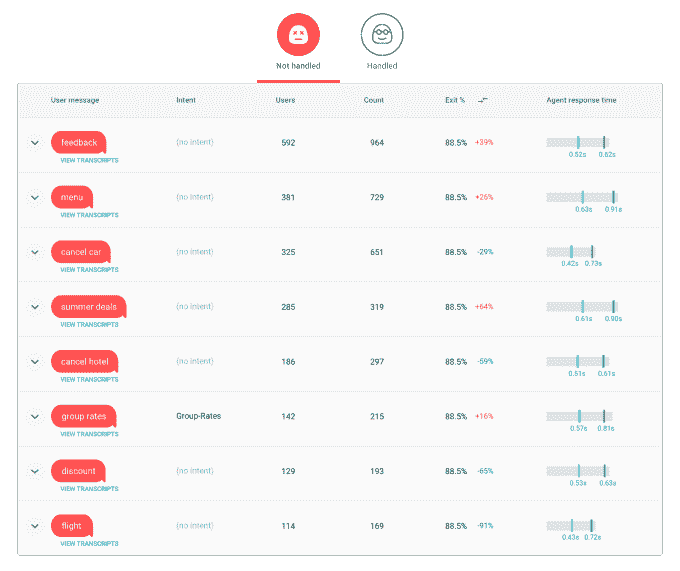
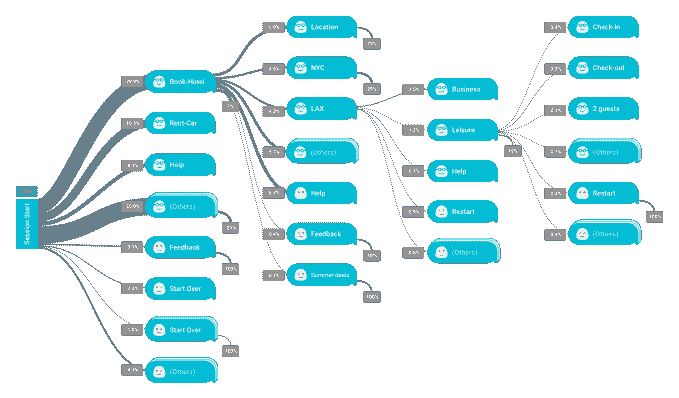

# 谷歌聊天机器人分析平台 Chatbase 向公众发布 

> 原文：<https://web.archive.org/web/https://techcrunch.com/2017/11/16/googles-chatbot-analytics-platform-chatbase-launches-to-public/>

在今年的谷歌 I/O 大会上，谷歌[悄悄地推出了一个新的聊天机器人分析平台](https://web.archive.org/web/20230209223315/https://techcrunch.com/2017/05/17/google-chatbase-chatbot-analytics/)，名为 [Chatbase](https://web.archive.org/web/20230209223315/https://chatbase.com/) ，这是一个在公司内部研发孵化器 120 区开发的项目。今天，在与包括 Ticketmaster、HBO、Keller Williams、Viber 和其他公司在内的数百名早期采用者进行测试后，该平台向所有人公开推出。

Chatbase 云服务背后的想法是提供更容易分析和优化聊天机器人的工具。这包括让 bot 构建者能够了解什么可以增加客户转化率，提高 bot 的准确性，并创造更好的用户体验。

这些数据可通过分析仪表板获得，开发人员可以在其中跟踪特定指标，如活跃用户、会话和用户保留率。这些见解给出了机器人健康的总体情况，并看到了一般趋势。

仪表板还允许 bot 创建者跨平台比较 bot 的指标，以查看某些平台是否需要额外的优化。

谷歌表示，该系统今天可以与任何语音或短信平台集成，包括脸书、Kik、Viber、Slack、WhatsApp、微信、Alexa、Cortana、Allo、Line、Skype、Twitter 等。

尽管它在早期有许多高知名度的测试者，但它不一定只被大公司使用。作为一项免费服务，Chatbase 支持任何规模的机器人构建者——无论他们有一个还是数百个正在运行的机器人。

例如，谷歌指出，一个早期的客户，[BLiP](https://web.archive.org/web/20230209223315/http://blip.ai/en/)——一个品牌机器人平台——已经使用 Chatbase 跟踪超过 50 个机器人的超过 200 万条信息。巧妙。与此同时，AI 使用 Chatbase 和为澳大利亚一家大型健康保险公司开发的机器人来帮助其眼镜店的客户。凯勒·威廉姆斯(Keller Williams)将 Chatbase 与一个机器人结合使用，让其 17 万名同事可以提问、管理约会、与其他同事联系，并跟踪他们的目标。

谷歌表示，Chatbase 平台上的其他测试者包括面向外部的客户支持、娱乐、建议和电子商务机器人，以及面向内部的生产力和信息发现机器人。

Chatbase 网站的客户名单包括:HBO、Keller Williams、Ticketmaster、Poncho、Swelly、Botnation AI、Viber、inGenius。AI，Starbutter AI，Foxsy，Crystal，FitWell，push，mia，Unicef。

除了机器人分析，该工具还利用谷歌的机器学习能力来计算出什么样的问题可能会影响机器人。

通常，开发人员将不得不搜索日志文件以找到用户消息中的模式，但 Chatbase 的系统将没有被处理的用户消息聚集在一起(这仍然只对早期访问测试人员可用)，并寻找机会回答更多的请求。然后，它提供了针对这两个问题优化 bot 的方法。

“一个例子是寻找和修复‘失误’，或者开发者最初没有预料到的支持动作的替代措辞，”谷歌发言人解释道。“就像在许多其他领域一样，机器学习和自然语言处理正在机器人分析领域开辟强大的新机遇。将谷歌的一些机器学习能力用于我们的用户是一个明显的优势，我们的用户对此非常兴奋，”他们补充道。

乐天旗下的 Viber 在 193 个国家拥有超过 9 亿用户，它用自己运行的贴纸机器人详细介绍了 Chatbase 的成功。

“我们通过优化具有高退出率的查询，将一个受欢迎的贴纸机器人的查询量增加了 35%，”该公司在谷歌分享的一份声明中说。“Chatbase 对改进我们的机器人帮助很大。Viber 补充说:“我们不是梳理日志，而是依靠它的机器学习能力来帮助确定所需优化的优先级，从而节省我们专注于构建新功能所需的宝贵时间。”。

Chatbase 中另一个值得注意的功能是跨会话的对话流的自动生成数据可视化。这让 bot 开发人员可以看到用户使用的常见路径，以及他们经常在哪里退出应用程序。漏斗报告突出显示了这些步骤，并显示了每个步骤的成功率。

该公司今天通过博客文章宣布 Chatbase [的全面上市，并补充说它是免费使用的。](https://web.archive.org/web/20230209223315/https://blog.chatbase.com/2017/11/chatbase-now-generally-available-to.html)

当被问及该公司计划如何利用该平台赚钱时，谷歌表示，这是它未来正在考虑的事情，但没有提供这些计划的细节。

谷歌也注意到了 Dialogflow 的用户。AI ，谷歌的[端到端平台](https://web.archive.org/web/20230209223315/https://techcrunch.com/2017/11/16/google-launches-an-enterprise-edition-of-its-dialogflow-chatbot-tool/)，用于构建跨平台的对话体验，将在 Dialogflow 中自动获得基本的 Chatbase 功能[。](https://web.archive.org/web/20230209223315/https://chatbase.com/documentation/dialogflow-integration)

Chatbase 的公开发布正值聊天机器人本身面临批评，指责其没有承诺的那么有用，并且经常遭受可用性问题的困扰。但该市场仍处于早期阶段，聊天机器人还没有退出市场。有些甚至变得更好，因为开发人员弄清楚了什么可行，什么不可行。

Chatbase 不是 chatbot [analytics](https://web.archive.org/web/20230209223315/https://chatbotsmagazine.com/which-analytics-the-top-5-analytics-platforms-for-chatbots-301154cf5dfe) 的唯一解决方案，但机器学习的角度可能会给它带来优势。此外，谷歌免费提供的能力可以帮助它获得机器人分析公司不一定能与之竞争的市场份额。然而，作为一个 Area 120 项目，目前还不清楚谷歌将在多大程度上长期支持该项目。迄今为止，大多数 120 地区的项目都是实验性的。Chatbase 似乎是那种将来应该升级为谷歌产品的东西。