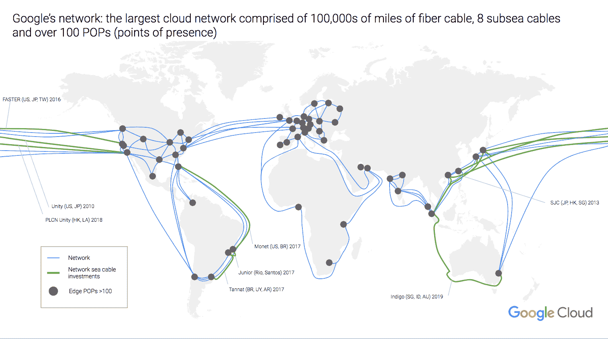
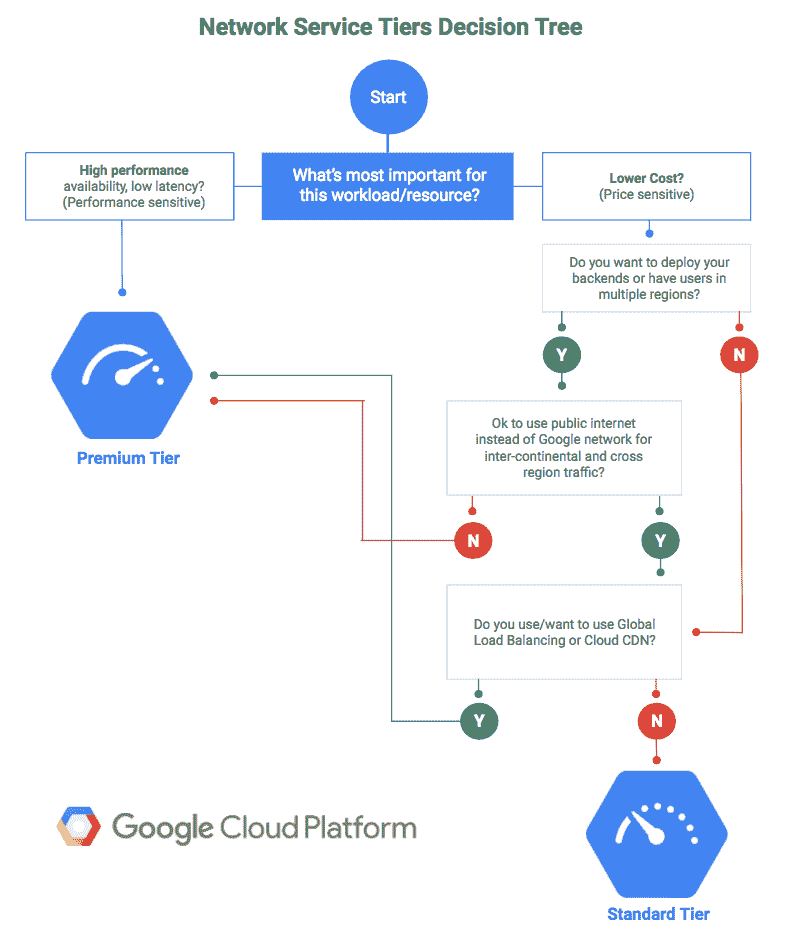

# 谷歌的云平台获得更便宜、性能更低的网络层 

> 原文：<https://web.archive.org/web/https://techcrunch.com/2017/08/23/googles-cloud-platform-gets-a-cheaper-lower-performance-networking-tier/>

# 谷歌的云平台获得了更便宜、性能更低的网络层

谷歌正在为其云平台用户提供一种新的、更便宜的网络选择。开发者现在可以[在](https://web.archive.org/web/20221208074630/https://cloud.google.com/network-tiers)和【标准层】之间选择，前者通过谷歌自己的高速网络尽可能长时间地将流量路由给他们的用户，以最小化跳数和距离，后者通过公共互联网路由流量，具有所有潜在的减速和额外的跳数。

“在过去的 18 年里，我们建立了世界上最大的网络，据一些统计，该网络提供了所有互联网流量的 25-30%，”谷歌技术基础设施 SVP Urs hlz le 在今天的公告中说道。“您可以享受与高级层相同的基础架构。但是对于某些用例，您可能更喜欢更便宜、性能更低的替代方案。借助网络服务层，您可以为每个应用选择最适合您的网络。”

标准层的价格比北美和欧洲的高级层低 24-33%。不过，谷歌对这两个层次使用不同的定价模式。高级流量的价格基于流量的来源和目的地，所以你要为流量在谷歌网络上传输的距离付费，而标准层的价格只基于来源的位置。

目前，所有谷歌云用户都在使用现在被称为高级层的东西。这种流量尽可能长时间地停留在谷歌自己的网络上(对于那些热衷于网络的人来说，这是冷土豆路由，然后通过谷歌在 T2 边缘网络上的 100 多个全球存在点之一传递到更广泛的互联网上。这最大限度地减少了延迟，并减少了流量通过谷歌自己的电缆时数据包丢失的变化。从用户设备到开发者应用的流量也是如此。流量被迅速转移到谷歌的边缘网络，然后再转移到公司的数据中心。

有了新的标准层，谷歌把你的流量交给公共互联网，而不是通过自己的网络路由。在那里，它会从一个网络跳到另一个网络，从一个 ISP 跳到另一个 ISP，这显然比使用谷歌自己的网络要慢。正如谷歌指出的，这与其他没有自己广泛网络的公共云提供商的做法类似。

谷歌与 Cedexis 合作，量化并公开监控 T2 这两个网络层 T3 的表现。不出所料，标准层上的吞吐量明显更慢，延迟更高(尽管[吞吐量](https://web.archive.org/web/20221208074630/https://portal.cedexis.com/ui/reports/share/1t703mtt6f6o)的差异比[延迟](https://web.archive.org/web/20221208074630/https://portal.cedexis.com/ui/reports/share/1t703mtt36xs?primaryDimension=platform&time=last_7_days&source=community&ipSource=client&statistic=percentile_50&probeType=0&group0Sort=percentile_50&group0Order=asc&table.group0Limit=10&vis.group1Limit=5&vis.group1Sort=percentile_50&vis.group1Order=asc&table.group1Limit=10&table.group1Sort=percentile_50&table.group1Order=asc&country%5B%5D=223&vis.platform=&timeScale=hour)的差异更明显)。

使用标准层的一个缺点是不能使用 Google 的全局负载均衡器和云 CDN。相反，您必须使用区域负载平衡。

如果你正试图决定为你自己的应用程序选择哪一层，这里有谷歌自己的便捷流程图:

