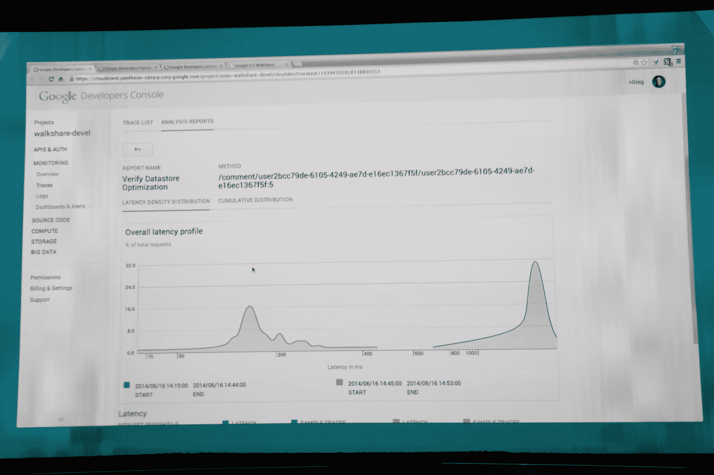
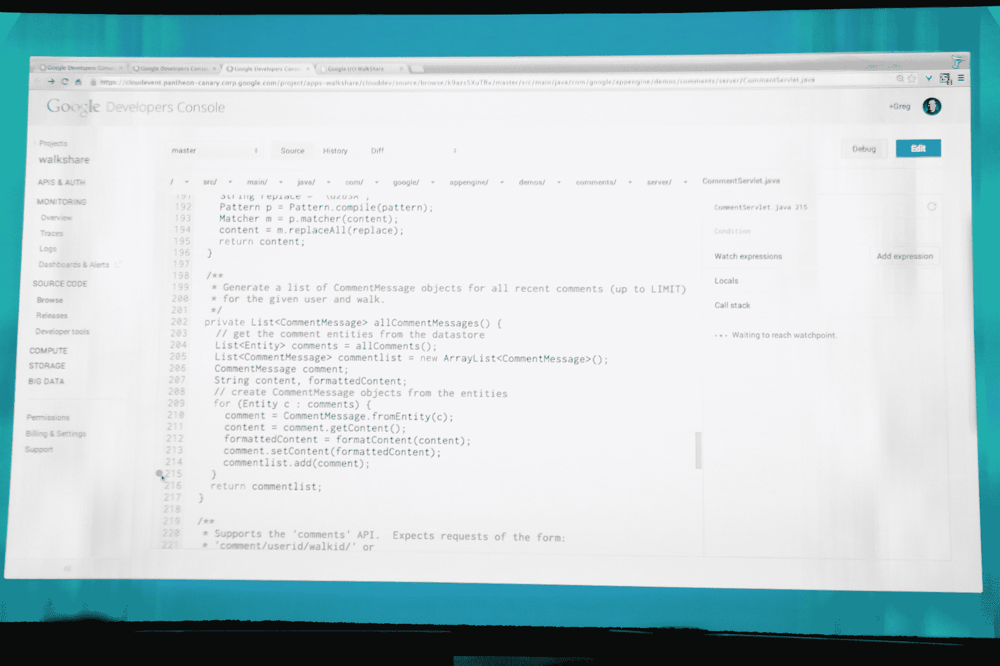

# 谷歌的云平台获得监控和调试应用的新工具 

> 原文：<https://web.archive.org/web/http://techcrunch.com/2014/06/25/googles-cloud-platform-gets-new-tools-for-monitoring-and-debugging-apps/>

# 谷歌的云平台获得了监控和调试应用程序的新工具

几个月前，谷歌[收购了](https://web.archive.org/web/20230125184609/https://techcrunch.com/2014/05/07/google-acquires-cloud-monitoring-service-stackdriver/)正在崛起的云监控服务 Stackdriver，意图将其集成到自己的云工具中。该公司并没有花很长时间来利用 Stackdriver 的专业知识，因为[在今天的 I/O 开发者大会上推出了基于该公司技术的第一款产品](https://web.archive.org/web/20230125184609/http://googledevelopers.blogspot.com/2014/06/cloud-platform-at-google-io-new-big.html)。

[谷歌云监控](https://web.archive.org/web/20230125184609/http://feedproxy.google.com/~r/ClPlBl/~3/PLH_Ct8w1FY/enabling-developers-to-tame-production-systems-in-the-cloud.html)，这项新服务的名称，为开发者提供在谷歌云上运行的应用的指标、仪表盘和警报，以及关于流行的开源服务如 Apache、Nginx、MongoDB、MySQL 和 Redis 的信息。

 

在许多方面，这类似于 New Relic 等其他云监控服务提供的功能。但与这些其他公司不同，谷歌显然专注于自己的服务，尽管很高兴看到它将继续支持其他一些应用程序。虽然 Stackdriver 非常关注 Amazon Web Services，但是我不认为 Google 会在短期内添加监视 EC2 实例的功能。

这不是谷歌推出的唯一监控功能。云跟踪允许开发人员更容易地可视化他们的应用程序在请求处理上花费的时间。它还可以很容易地看到一个应用程序的性能在不同版本之间的变化。

除了这两款工具，Google 今天还推出了 Cloud Debugger。该公司表示，这将为基于云的应用程序带来现代调试。谷歌表示，云调试器将“为你在代码中设置的任何观察点提供完整的堆栈跟踪和所有局部变量的快照，同时你的应用程序继续在生产中不受干扰地运行。”

在今天的 I/O keynote 演示中，谷歌展示了开发人员如何利用这一点来发现 bug——在这种情况下是字体问题——例如，通过在开发人员控制台的生产代码中设置一个观察点。