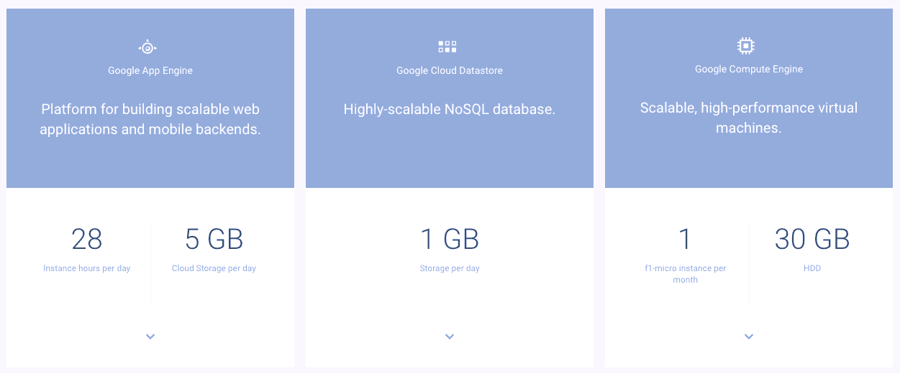

# 谷歌的云平台提高了免费等级，并增加了永远免费的计算和存储服务 

> 原文：<https://web.archive.org/web/https://techcrunch.com/2017/03/09/googles-cloud-platform-improves-its-free-tier-and-adds-always-free-compute-and-storage-services/>

# 谷歌的云平台提高了免费等级，增加了永远免费的计算和存储服务

谷歌今天悄悄地为其云平台推出了一个改进的[永远免费层](https://web.archive.org/web/20221208141707/https://cloud.google.com/free/docs/always-free-usage-limits)和试用程序。

免费层，现在提供了足够的能力在谷歌的云中运行一个小应用程序，是除了一个扩展的免费试用程序之外提供的(是的——这有点令人困惑)。这个免费的*试用*给你 300 美元的积分，你可以在 12 个月内使用。此前，谷歌也提供了 300 美元的信用，但这些必须在 60 天内使用。

该公司从未真正宣传过的免费*层*，现在允许在计算引擎、云发布/订阅、谷歌云存储和云功能中免费使用一个小( [f1-micro](https://web.archive.org/web/20221208141707/https://cloud.google.com/compute/docs/machine-types) )实例。总的来说，免费层现在包括 15 项服务。

添加计算引擎实例和 5GB 的免费云存储空间可能是这里最重要的更新，因为这些毕竟是大多数云应用程序的核心服务。你可以在这里找到精确的极限[。](https://web.archive.org/web/20221208141707/https://cloud.google.com/free/docs/always-free-usage-limits)

值得注意的是，免费层仅在谷歌的美国东部 1、美国西部 1 和美国中部 1 地区可用。

随着这一举动，谷歌显然正在加强对 AWS 的攻击，AWS 为其用户提供类似但更有限的免费等级和 12 个月免费试用程序。事实上，谷歌的许多限制看起来与 AWS 的 12 个月免费层非常相似，但 AWS 永远免费层不包括免费虚拟机(例如，你只能免费获得 12 个月)。我预计 AWS 将在不久的将来与谷歌持平，并延长其免费服务。

这里的想法显然是让人们适应谷歌的平台。通常是在云中运行爱好项目的开发人员让企业中的整个团队迁移，或者决定使用某个公共云来运行初创公司的基础架构。新开发人员通常也会选择 AWS 来了解云，因为它有 12 个月的免费试用期。谷歌之前提供的 60 天 300 美元的信贷对那些想学习如何使用谷歌云的开发者来说根本没有用。

