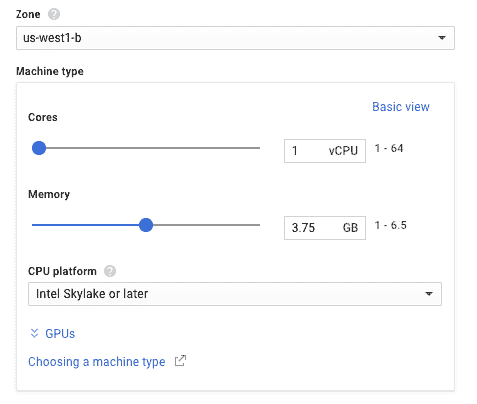

# 谷歌的计算引擎现在允许你在 CPU 平台之间进行选择 

> 原文：<https://web.archive.org/web/https://techcrunch.com/2017/05/31/googles-compute-engine-now-lets-you-choose-between-cpu-platforms/>

# 谷歌的计算引擎现在允许你在 CPU 平台之间进行选择

谷歌今天正在更新其[计算引擎](https://web.archive.org/web/20221206215815/https://cloud.google.com/compute/)云计算服务，增加了许多新功能，这些功能对需要高性能处理器和/或访问大量内存的用户来说尤其有趣。

这些更新的基础是英特尔下一代 Skylake Xeon 处理器的全面上市，该处理器在该平台上拥有多达 64 个内核。Skylake 支持在二月进入测试版[。这些机器现在可以在谷歌的三个云平台地区使用:美国西部、西欧和东亚太平洋地区。其他地区的支持将很快跟进。](https://web.archive.org/web/20221206215815/https://cloudplatform.googleblog.com/2017/02/Google-Cloud-Platform-is-the-first-cloud-provider-to-offer-Intel-Skylake.html)

此外，谷歌今天宣布，64 核实例和对 Broadwell CPUs 的支持现已在其所有地区推出。

 鉴于计算引擎现在采用了相当多的基于英特尔的 CPU 平台(Sandy Bridge、Ivy Bridge、Haswell、Broadwell 和现在的 Skylake)，Google now 还让你选择你想为你的项目使用哪一个。要做到这一点，你只需选择你的首选 CPU 平台，你总是保证得到至少一个你选择的，甚至可能是一个更新的。

在接下来的 60 天内，Skylake 虚拟机(VM)的成本将与使用旧机器的 VM 相同；之后，Skylake 机器将比使用旧 CPU 的机器贵 6%到 10%。

通过此次更新，计算引擎用户现在还可以在选择构建自己的[定制机器类型](https://web.archive.org/web/20221206215815/https://cloud.google.com/custom-machine-types/)并选择新的扩展内存选项时，为每个虚拟机实例连接高达 455 GB 的内存。以前，您必须遵守内存和虚拟 CPU 数量之间的特定比例，最高为 6.5 GB。