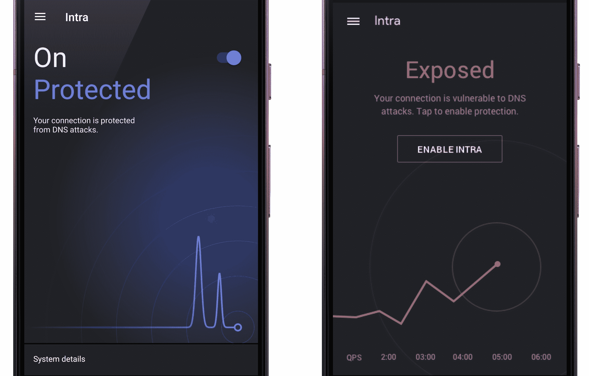

# 谷歌的网络部门 Jigsaw 推出了 Intra，这是一款致力于打破审查制度的新安全应用 

> 原文：<https://web.archive.org/web/https://techcrunch.com/2018/10/03/googles-cyber-unit-jigsaw-introduces-intra-a-security-app-dedicated-to-busting-censorship/>

# 谷歌的网络部门 Jigsaw 推出了 Intra，一款致力于破坏审查的新安全应用

谷歌母公司 Alphabet 旗下的 Jigsaw 发布了一款新应用 Intra，旨在保护用户免受政府支持的审查。

Intra 是一个新的应用程序，旨在防止 DNS 操纵攻击。每当您访问一个网站时，容易记住的网址就会被转换成不太容易记住的 IP 地址，通常是通过不安全的连接。这使得暴虐的政府——比如土耳其，它以前就使用过这种技术——很容易拦截网址请求，或者当场杀死它们以阻止网站加载，或者重定向到一个虚假的网站。

Intra 表示，通过将你所有的浏览查询和应用流量通过加密连接传递到可信的域名服务器，它可以确保你可以在没有干扰的情况下使用你的应用，或者在没有干扰的情况下访问正确的网站。

“Intra 使用起来非常简单。只要下载应用程序并打开它，”竖锯说。“就是这样。”

Jigsaw 已经在互联网接入受到限制或监控的地区取得了一些成功。据报道，委内瑞拉[政府利用 DNS 操纵](https://web.archive.org/web/20230121000234/https://freedomhouse.org/report/freedom-net/2017/venezuela)阻止公民访问新闻网站和社交网络。

该应用程序默认使用谷歌自己的可信 DNS 服务器，但用户也可以通过 Cloudflare 传递他们的浏览请求，cloud flare 也托管其自己的可公开访问的安全 DNS 服务器，或任何其他安全 DNS 服务器。

诚然，这需要对谷歌和 cloud flare——或任何第三方——有一点信任。Jigsaw 发言人告诉 TechCrunch，Intra 对谷歌 DNS 的使用受其隐私政策(T4)的保护，Cloudflare 也有自己的隐私政策(T6)。

Jigsaw 表示，它将把应用程序烘焙成 Android Pie，该应用程序已经允许加密的 DNS 连接。但 Jigsaw 也在向世界上经济较弱的地区的用户提供这款应用，这些地区的用户几乎不可能从旧设备升级，因此他们可以从安全功能中受益。

这是拼图游戏试图解决的安全和隐私难题中的最新一块。

鲜为人知的字母表部门专注于防止审查、网络骚扰威胁和打击暴力极端主义。该孵化器致力于通过提供工具和服务，为高风险目标提供更安全的在线服务，从而增强言论和表达自由。

Jigsaw 还在其他几个反审查应用上投入了时间，包括保护网站免受分布式拒绝服务攻击的 Project Shield 和 Outline，后者为记者和活动人士提供了一个通过安全通道传输数据的虚拟私人网络。