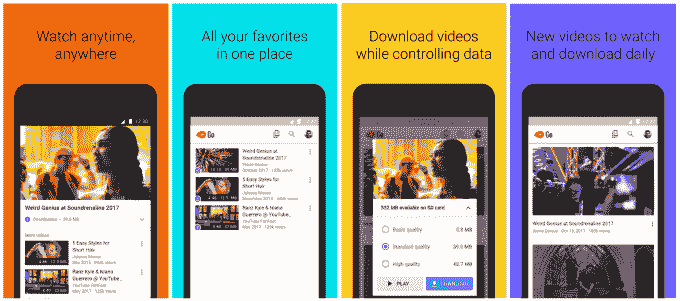

# 谷歌的数据友好应用 YouTube Go 扩展到 130 多个国家，现在支持更高质量的视频

> 原文：<https://web.archive.org/web/https://techcrunch.com/2018/02/01/googles-data-friendly-app-youtube-go-expands-to-over-130-countries-now-supports-higher-quality-videos/>

YouTube Go 是为新兴市场打造的移动版 YouTube，具有离线观看和附近分享等功能，如今已扩展到全球 130 多个国家。这一更广泛的推广将使大量希望能够观看 YouTube 视频的人能够使用 YouTube，即使他们没有良好的连接，或者发现自己离线。

新增国家包括中南美洲、中东、非洲、加勒比海、亚洲和其他地区。

该应用于 2016 年 9 月首次在[推出](https://web.archive.org/web/20230315095321/https://techcrunch.com/2016/09/27/google-youtube-go-app/)，然后[于去年春天推出](https://web.archive.org/web/20230315095321/https://youtube.googleblog.com/2017/04/youtube-go-beta-launches-in-india.html)测试版。

像其他为新兴市场设计的应用程序一样，YouTube Go 包括一套考虑到数据成本高、信号强度差和安卓设备上普遍使用 SD 卡的功能。

首先，该应用程序允许用户在连接较慢时选择较低质量的视频流来控制他们的播放体验，或者他们可以选择保存视频以便离线时播放。这种离线播放功能允许用户将 YouTube 视频下载到他们的手机或 SD 卡上。(在决定下载之前，您还可以观看视频预览。)

另一个聪明的功能是 YouTube Go 的分享功能，允许你向附近的朋友展示视频——这是 YouTube Go 绕过没有可靠连接的设备的另一种方式。

该功能首先使用蓝牙和 BLE 定位朋友的手机以进行发现并建立连接，然后使用 Wi-Fi 热点(手机上的功能)和 Wi-Fi Direct 进行传输。YouTube 解释说，该应用程序使用既定的无线和加密协议在两部手机之间建立了安全的无线通道。然后，在视频可以在 YouTube 应用程序中播放之前，接收方从 YouTube 的服务器上下载一个独特的解密密钥。

然而，该公司告诉我们，它一直在试验各种协议，未来可能会选择使用不同的协议，为“最广泛的设备提供最快、最可靠和最安全的连接。”

此外，YouTube Go 应用程序的主屏幕突出显示了在当地受欢迎的视频，并以用户的语言呈现。

YouTube Go 的第一个市场是印度，但去年它的覆盖范围扩大到了其他 14 个国家，包括印度尼西亚、尼日利亚、泰国和其他国家。

https://www.youtube.com/watch?v=GTk2_QSf2Jk&authuser=0

随着今天的发布，该公司表示，它根据这些早期用户的反馈进行了一些设计调整。

现在，YouTube Go 允许用户选择在信号强的时候(例如，当连接到良好的 Wi-Fi 网络时)，除了基本和标准质量之外，还可以下载、播放或分享高质量的视频。

它还使“分享附近”功能更容易访问，并增加了用户一次分享多个视频的能力。

该应用还改进了个性化推荐。现在，用户可以在主屏幕上下拉新的推荐，当他们喜欢的频道添加新的视频时，会收到提醒。

YouTube Go 在谷歌 Play 商店[这里](https://web.archive.org/web/20230315095321/https://play.google.com/store/apps/details?id=com.google.android.apps.youtube.mango&hl=en)有售。