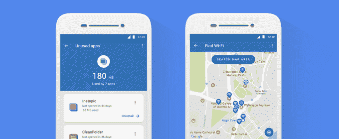

# 谷歌的 Datally 应用程序增加了更多限制移动数据使用的方法 

> 原文：<https://web.archive.org/web/https://techcrunch.com/2018/06/18/googles-datally-app-adds-more-ways-to-limit-mobile-data-usage/>

去年 11 月，[谷歌推出了 data ly](https://web.archive.org/web/20221206110225/https://techcrunch.com/2017/11/30/google-datally-data-saver/)，这是一款主要针对新兴市场的数据保存应用，在这些市场，用户通常依赖预付费 SIM 卡，无法享受不限次数的数据套餐。该应用程序允许用户精确控制哪些应用程序可以使用数据，这在试点测试期间节省了 30%的数据使用量，现在平均为用户节省了 21%。今天，谷歌对 Datally 进行了升级，增加了几个新功能，将帮助用户进一步减少数据使用。

一个关键特性是引入了每日限额，允许您控制每天的数据使用量。这一条更多的是关于围绕数据消费创造更好的习惯，这样你就不会在一天内不小心烧掉太多的数据，然后在月底前没有留下任何数据。

这也与谷歌的更大努力有关，即让用户更深入地了解他们在使用移动设备时的行为，并提供更多工具来对抗智能手机的成瘾特性。

该公司在五月[宣布了](https://web.archive.org/web/20221206110225/https://techcrunch.com/2018/05/08/android-rolls-out-a-suite-of-time-management-controls-to-promote-more-healthy-app-usage/)新的 Android 用户时间管理功能，以及帮助用户在就寝时间静音和放松的新功能。它也有[软件](https://web.archive.org/web/20221206110225/https://techcrunch.com/2017/09/28/googles-parental-control-software-family-link-launches-to-public/)让父母限制孩子看屏幕的时间。

虽然 Datally 功能主要是为了保存数据，但它承认，人们经常很容易沉迷于智能手机，忘记自己想要花多少时间，进而忘记自己想要多少移动数据。

另一项新的数据功能允许您启用访客模式，在这种模式下，您可以控制借用您手机的人可以使用多少数据——这在家庭成员共享手机的情况下非常有用。

与此同时，“未使用的应用”功能会突出显示那些你已经停止使用但仍可能泄露数据的应用。谷歌指出，对于许多人来说，20%的移动数据来自后台使用数据的应用程序，这些应用程序超过一个月没有打开。它说，未使用的应用程序会找到那些罪魁祸首，这样你就可以卸载它们。

最后，新的 Wi-Fi 地图显示了附近所有的 Wi-Fi 网络，因此您可以找到那些信号良好的网络，并停止使用您的移动数据。

虽然 Datally 旨在帮助的“下一个十亿用户”上网，但它并不局限于新兴市场。任何关心数据使用的人都可以尝试一下。

谷歌表示，新增加的内容将于今天推出。

下载量超过 1000 万次的 Android 应用程序在 Google Play 上是免费的。