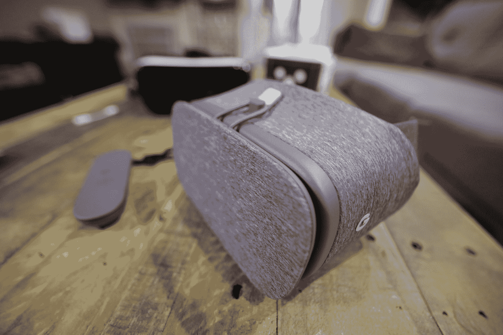
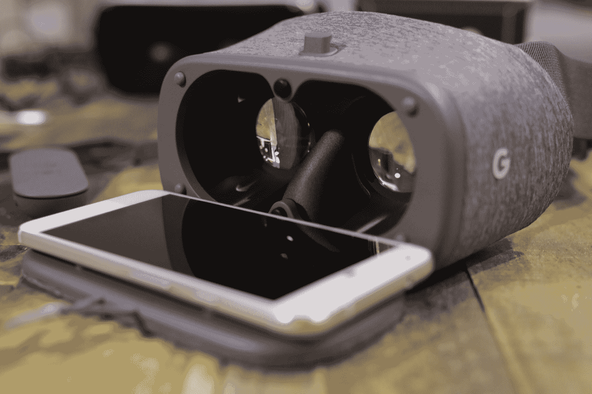
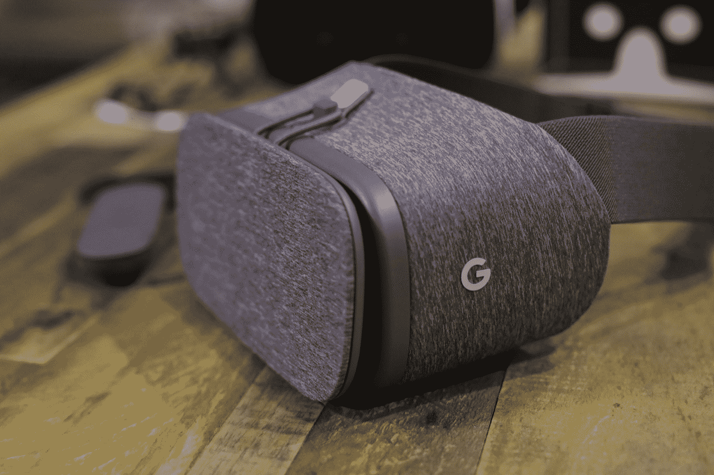

# 谷歌的 Daydream View 让我再次成为了消费者 VR TechCrunch 的信徒

> 原文：<https://web.archive.org/web/https://techcrunch.com/2016/11/10/googles-daydream-view-made-me-a-believer-again-in-consumer-vr/>

谷歌的新 Daydream View VR 头戴设备从今天开始上市，这款织物包裹的轻质塑料纸板继任者是一大进步，不仅是谷歌在创建 VR 头戴设备方面的首次适度尝试，也是移动虚拟现实的一大进步。

## 卑微的出身

当谷歌在 2014 年开发者大会上首次推出 Cardboard 时，时任谷歌产品总监的桑德尔·皮帅展示了这款由普通材料制成的耳机，漫不经心地间接嘲笑了脸书不久前宣布的雄心勃勃且昂贵的 Oculus 收购。谷歌的虚拟现实耳机由价值约 10 美元的材料制成，尽管与其他虚拟现实硬件相比，许多人认为它是一个玩具，但它最终为 Daydream 提供了很多指导，后者很容易成为休闲移动虚拟现实的新领导者。

Daydream View 的基本前提是一样的:你所要做的就是把手机滑进去，然后就可以走了。许多人认为谷歌自下而上的虚拟现实方法过于随意，但我当时预测，该公司对虚拟现实的低端看法将是 Rift 等高端产品唯一真正有竞争力的替代选择。虚拟现实的中间地带很难找到，因为中端成本的权衡无法弥补整体体验的巨大下降。Cardboard 之所以成功，正是因为它并没有什么真正的承诺，而且它基本上也不需要任何成本。

## 设定期望

Daydream View 的价格标签可能会在一定程度上提高体验预期，但它在美国仍然只有 79 美元，比其最接近的竞争对手三星 Gear VR 低 20 美元。虽然更高的价格标签可能意味着人们期望更多，但 Daydream View 将超出大多数人的期望。

Daydream View 依然是 VR 最低摩擦的接入点；它实际上比 Cardboard 更容易使用，因为内置了头带和捆绑的蓝牙控制器。但其 VR 体验的质量至少与 Gear VR 不相上下——根据我迄今为止使用它的时间，它更好，这要归功于更明智的 VR hub 和导航元素，这些元素建立在用户对 Android 和 Play Store 的熟悉程度上。

让它与你的手机一起工作，至少是与谷歌的 Daydream View 一起提供的 Pixel XL 审查单元一起工作，也比开始使用 Gear VR 容易得多，主要是因为没有电缆或物理连接。你折下 View 的前盖，将兼容 Daydream 的手机放入耳机，然后合上。你甚至不需要小心对齐屏幕图像-它会检测它的位置并自动对齐，以便通过耳机镜头获得清晰的视图。

与最简单的家庭虚拟现实体验 PlayStation VR 相比，这是一个更低的准入门槛，捆绑的控制器非常适合确保一旦你沉浸其中，就不会对如何导航感到困惑。Gear VR 的游戏手柄支持很受欢迎，但开箱后，你只能使用耳机侧面的触摸板笨拙地导航，这从来都不像是一种自然的交互模式。

## 正确的介绍性内容

就发布时可用的标题而言，Daydream 的内容库有点单薄，尤其是与 Gear VR 的可用选项相比。但谷歌似乎选择了第一方和第三方软件产品的质量，对 YouTube 360 度视频的出色原生支持意味着不缺乏休闲内容。即将推出的支持 Daydream 的应用程序列表也提供了很多值得期待的东西，这些东西可能会吸引那些不确定虚拟现实但希望通过熟悉的体验进入虚拟现实的用户——例如，网飞和 HBO Go 应该会有所帮助。

谷歌在 Daydream View 的设计上做了大量工作，从织物外观到单带设计和重量轻，虽然当你在飞机或公共汽车上使用它时，它肯定会吸引眼球，但他们在使它看起来更容易接受方面所做的工作不应被低估。

## 面向大众的 VR

最终，Daydream View 感觉像是下一步，而不是消费者 VR 的最终到达点。但它在许多非常重要的方面推动了该领域的发展——这些方面意味着 Daydream VR 可能会成为大量移动用户的第一次 VR 体验，幸运的是，他们不会对自己的发现感到失望。

早期的虚拟现实宣传让位给了现实，这表明它的利基地位不会很快消失——Rift 和 Vive 太专业，太昂贵，太耗电，无法与任何类似于普通观众的东西合作。后来者做了更多的工作，让我相信消费者虚拟现实市场有真正的潜力；对于任何喜欢游戏的人来说，PSVR 都是一件非常重要的装备，Daydream View 有可能给日常移动用户留下深刻印象，这是当今任何其他产品都无法企及的。