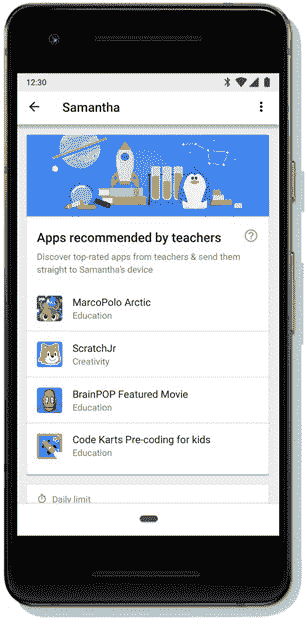

# 谷歌的 Family Link 软件现在推荐“教师认可”的应用程序 

> 原文：<https://web.archive.org/web/https://techcrunch.com/2018/06/12/googles-family-link-software-now-recommends-teacher-approved-apps/>

谷歌今天正在扩展其 Android 父母控制软件 [Family Link](https://web.archive.org/web/20221206220635/https://families.google.com/familylink/) 的功能，以超越帮助父母更好地管理孩子的设备和应用程序使用。现在，Family Link 应用程序还将帮助父母了解他们可能希望为孩子安装什么应用程序。在一个新的探索板块中，Family Link 将推出一个面向 6 至 9 岁儿童的教育应用列表，家长只需轻轻一点就可以安装。

该版块宣称，这些应用程序是“老师推荐的”。

谷歌解释说，它与美国各地的教师合作，提出了这个具有教育价值的应用程序的精选列表。这些教师被招募来根据他们在学习和儿童发展方面的专业知识对内容进行评级，他们在多年经验、人口统计和美国的地理位置等方面具有不同的背景

该应用程序还必须满足谷歌的家庭设计(DFF) [计划的要求。](https://web.archive.org/web/20221206220635/https://play.google.com/about/families/designed-for-families/program-requirements/)

发布时，推荐的应用程序来自 MarcoPolo Learning Inc .、BrainPOP、Edoki Academy 等出版商，包括那些教孩子了解事实和数据、世界各地有趣地方的应用程序，当然，还有谷歌！–编码的基础，以及其他。

目前有几十个推荐的应用程序，但它们不会一下子出现。相反，谷歌告诉我们，该列表将每周更新一次，以免家长或孩子不知所措。

随着时间的推移，谷歌计划为该功能添加更多应用，包括针对其他年龄段的应用。

目前，所有的应用程序都是免费的，但谷歌的一位发言人说，谷歌可能会选择在未来突出付费应用程序。

父母可以点击应用程序来访问他们在 Google Play 上的页面，并通过点击“安装”按钮直接将它们添加到孩子的设备上。

该功能目前在美国的 Family Link 移动应用程序中为父母提供。谷歌表示，随着时间的推移，它将在其他市场推出。

谷歌在一份声明中称之为“有营养的”应用程序的建议，正值主要科技公司越来越关注花在设备上的时间，以及消费者——父母和其他人——越来越担心时间花得不值得。

在 5 月份的谷歌开发者大会上，公司[详细介绍了新的基于 Android 的工具](https://web.archive.org/web/20221206220635/https://techcrunch.com/2018/05/08/android-rolls-out-a-suite-of-time-management-controls-to-promote-more-healthy-app-usage/)，用于管理和监控屏幕时间，以促进更健康的应用和设备使用。这包括防止手机分散或刺激用户的方法，以及应用程序的时间限制。

这种控制也是父母希望他们的孩子拥有的，这就是 2017 年秋季公开推出的[家庭链接所提供的。](https://web.archive.org/web/20221206220635/https://techcrunch.com/2017/09/28/googles-parental-control-software-family-link-launches-to-public/)

但是，当“屏幕时间”本身也被视为一个问题时，谷歌希望展示一些有价值的应用程序是有道理的。

该功能今天在 Android 的 Family Link 上推出，随后将提供 iOS 支持。