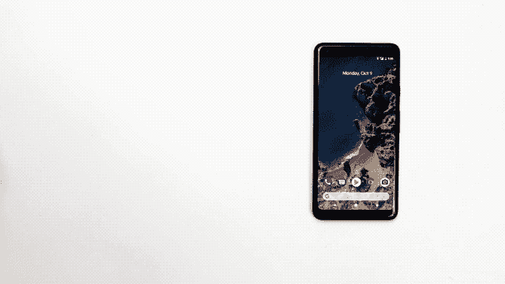

# 谷歌的快速配对功能开始出现在非像素安卓手机上 

> 原文：<https://web.archive.org/web/https://techcrunch.com/2017/10/31/googles-fast-pair-feature-starts-arriving-on-non-pixel-android-phones/>

# 谷歌的快速配对功能开始出现在非像素安卓手机上

上个月，在铺天盖地的新闻中，谷歌的 Pixel 2 事件，该公司似乎掩盖了快速配对功能。这是可以理解的——它在活动中经历了很多事情。此外，这远不是该公司新推出的 Pixel Buds 耳机中最酷的东西(这个头衔属于 Babelfish-esque 实时翻译功能)。

该功能类似于苹果公司推出的 W2 芯片，只需轻点几下就能实现即时、便捷的蓝牙配对。当然，快速配对有一个重要的优势:更好的兼容性。作为 Google Pixel 独家推出的功能[开始向所有运行 Google Play 服务 11.7 及更高版本的 Android 设备推出](https://web.archive.org/web/20221006162331/https://android-developers.googleblog.com/2017/10/announcing-fast-pair-effortless.html)(请注意，需要 Android 6.0 及更高版本)。

苹果版本是苹果 AirPods 的核心(以及随后的 Beats 版本)，谷歌的版本肯定会受益于更广泛的可用性。除了跨 Android 制造商工作之外，Fast Pair 还兼容各种不同公司的蓝牙耳机。Pixel Buds 和 Libratone 的 solid Q Adapt 是最先宣布的，谷歌很快将 Plantronics Voyager 8200 耳机添加到该列表中。

选择仍然非常有限，谷歌与特定的早期合作伙伴合作，帮助开发 Fast Pair。不过，除了向更多手机开放之外，该公司还在其公共论坛上向“蓝牙配件”制造商发出呼吁——这一举动表明该公司计划将 Fast Pair 推广到耳机和头戴式耳机之外的更多领域。

Pixel Buds 是在内部创建的，旨在为该公司决定在其新手机上取消耳机插孔的消费者群体提供支持。向一个更大的兼容设备生态系统开放快速配对应该会更好地缓冲这一打击——并且可能会让更多的手机制造商自己放弃插孔。