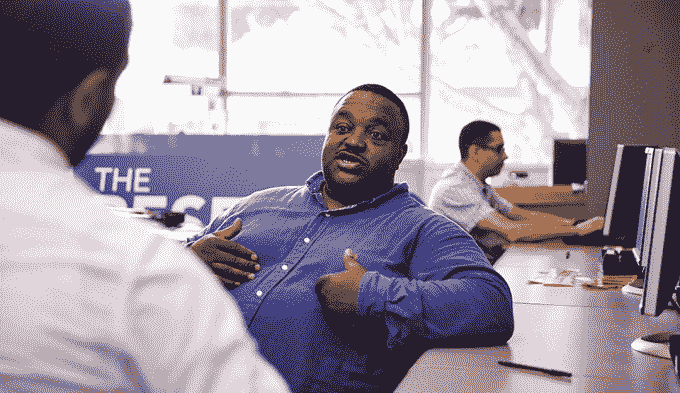
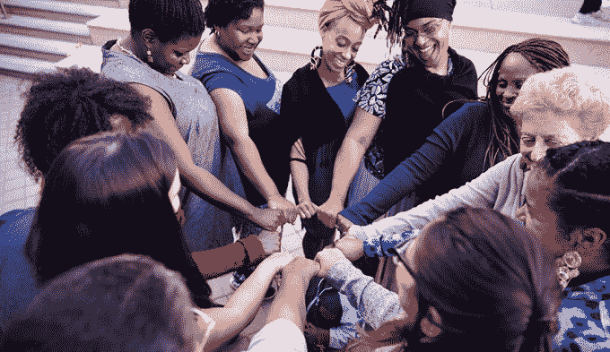
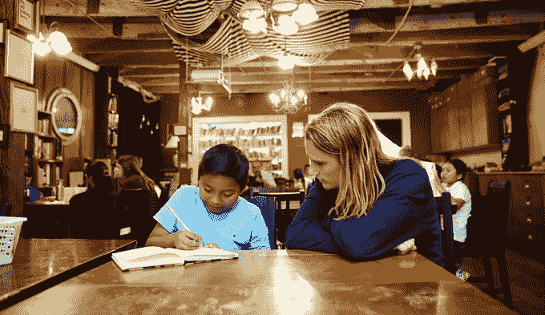

# 谷歌向旧金山湾区关注社会影响的非营利组织拨款 500 万美元 

> 原文：<https://web.archive.org/web/https://techcrunch.com/2015/09/29/googles-giving-5-million-to-sf-bay-area-non-profits-focused-on-social-impact/>

谷歌刚刚公布了第二次影响力挑战的 10 名决赛选手:湾区，这是一项通过资助当地非营利组织和慈善机构来推动社会变革的努力。前四名组织获得 50 万美元的资助，其余六个组织各获得 25 万美元。*谷歌还向另外 15 个非营利组织提供了 10 万美元的资助，使捐款总额达到 500 万美元。

谷歌让公众来决定哪四个组织将获得 50 万美元的资助。您最多可以为四个想法投票，截止日期为 10 月 20 日。所有的想法都很棒，所以我建议[在投票前看看所有的想法](https://web.archive.org/web/20230129220910/https://impactchallenge.withgoogle.com/bayarea2015)。也就是说，这四个对我来说非常突出:

[重置基金会](https://web.archive.org/web/20230129220910/https://theresetfoundation.org/)希望通过建立监狱的替代方案，为年轻成年人(18 至 24 岁之间)重建司法系统。这个想法是为年轻人开设一个住宿校园，学习技术，获得职业培训和接受社会情感健康支持。

Essie 正义小组正在建立一个网络，通过其康复到倡导课程，赋予妇女权力并为其提供工具和资源，以实现社会变革。如果获得这笔赠款，Essie 正义集团将能够在未来两年内帮助 1000 名妇女和家庭。

[826 Valencia](https://web.archive.org/web/20230129220910/http://826valencia.org/) 想把田德隆区的一家酒店改造成一个辅导中心，让孩子们学习如何写作，寻找他们的声音，探索他们的想象力。目的是解决海湾地区大约三分之一的五年级学生不能熟练读写的不公平现象。

[隐藏的天才项目](https://web.archive.org/web/20230129220910/http://www.hiddengeniusproject.org/)在技术、企业家精神和领导技能方面培训和指导年轻的黑人男性。有了 50 万美元的资助，隐藏的天才项目将启动一个多年计划，再培训 100 名年轻黑人，并在未来三年内为总共 2000 人提供服务。

这是另外六个入围者:[城市年](https://web.archive.org/web/20230129220910/http://www.votecy.com/)，[基瓦](https://web.archive.org/web/20230129220910/http://www.kiva.org/)，[芳草地艺术中心](https://web.archive.org/web/20230129220910/http://www.ybca.org/)，[谈话要点](https://web.archive.org/web/20230129220910/http://www.talkingpts.org/)，[大电梯](https://web.archive.org/web/20230129220910/http://www.thebiglift.org/)和[湾景/猎人点社区法律](https://web.archive.org/web/20230129220910/https://bhpcommunitylegal.org/)。

在过去的两年里，谷歌已经从最受抗议的科技公司之一变成了该地区最大的慈善和非盈利组织。

据《旧金山商业时报》报道，去年，谷歌向湾区慈善机构捐赠了 3963 万美元。谷歌积极地想出回馈社区的方法，这很好，但我们不能不注意到房间里仍然有一头巨大的大象:中产阶级化导致的低收入人群的流离失所。

*这个故事的早期版本错误地指出，其余六人每人获得 10 万美元。这个故事后来经过了编辑，以反映正确的金额 250，000 美元。