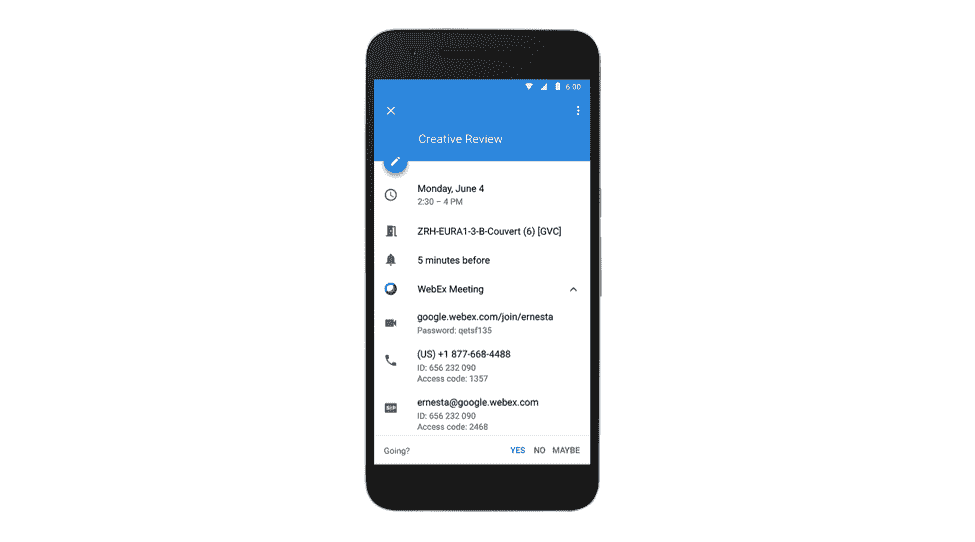
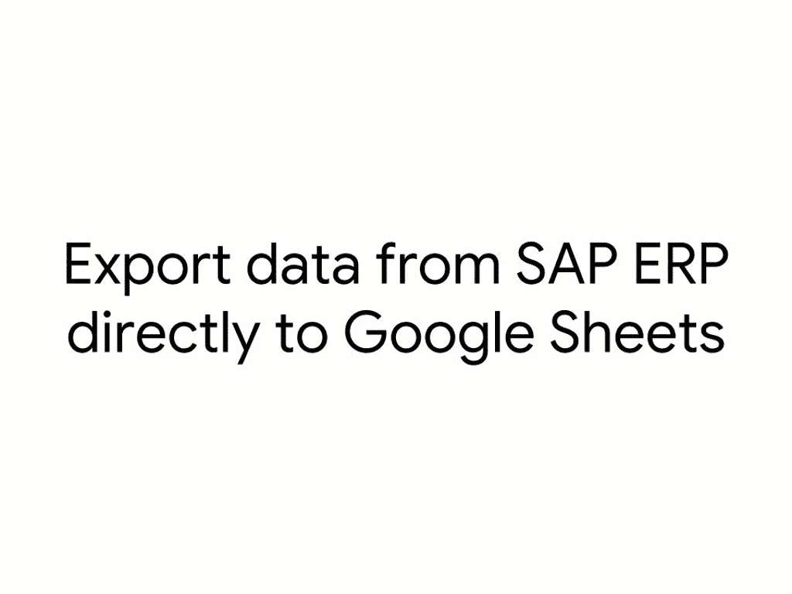

# Google 的 Hangouts Meet 将很快与 Polycom 和 Cisco TechCrunch 的硬件兼容

> 原文：<https://web.archive.org/web/https://techcrunch.com/2018/06/04/googles-hangouts-meet-will-soon-be-compatible-with-hardware-from-polycom-and-cisco/>

# 谷歌的 Hangouts Meet 将很快与 Polycom 和思科的硬件兼容

G Suite 即将迎来一系列新的集成。

[例如，Hangouts Meet](https://web.archive.org/web/20221217125159/https://meet.google.com/) 是谷歌为企业指定的视频会议解决方案，尽管它很容易使用，但大多数企业已经投资了 Polycom 和思科等公司的类似解决方案，或者他们选择了微软的 Skype for Business 作为他们的首选服务。然而，很快，企业将获得更多的选择，因为谷歌今天宣布，这些系统上的任何人现在都可以加入 Hangouts Meet 视频电话。这些集成将在未来几周内上线。

谷歌 G Suite 产品管理总监 Rany Ng 在今天的公告中写道:“最令人沮丧的事情莫过于主持一场会议，但由于技术问题，人们很难参加——这可能会中断工作流程，降低生产率。”。“我们希望让企业更容易使用会议解决方案，如 Hangouts Meet，而不必担心与现有设备的兼容性。”

谷歌与 Pexip 合作建立了这个项目，Pexip 是一家专门从事会议平台互操作的公司。Pexip 的专长是 Skype for Business，但对于该产品，该公司显然正在拓展业务，并增加了对 Hangouts Meet 的支持。

除了允许更多硬件平台的用户加入 Meet calls 之外，谷歌今天还宣布，它正在使第三方会议服务更容易将其服务更深入地集成到谷歌日历中。例如，如果您正在使用 Webex，只需轻轻一点，就可以从日历中加入 Webex 呼叫。谷歌表示，Arkadin、GoToMeeting、LogMeIn、Dialpad、RingCentral、Vidyo 和 Vonage 目前正在为他们的用户构建类似的日历插件。

如果你需要一个房间来接听这些电话，谷歌今天还宣布，在谷歌日历中查看和预订存储在 Exchange 和 Office 365 中的房间变得更加容易。不过，这种集成将在几个月后上线。

然而，这还不是今天集成的全部消息。谷歌还让从 SAP 的企业资源规划工具导入数据到谷歌表单并在那里进行分析变得更加容易。

