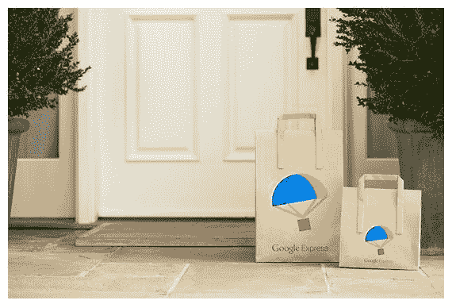

# 谷歌的送货上门服务 Google Express 登陆新英格兰

> 原文：<https://web.archive.org/web/https://techcrunch.com/2016/09/28/googles-home-delivery-service-google-express-hits-new-england/>

谷歌今天宣布扩展其送货上门购物服务[谷歌快递](https://web.archive.org/web/20230324134505/https://www.google.com/express)，该服务现已覆盖东海岸的大部分地区。这项服务让在线购物者可以通过网络或专门的移动应用程序订购消费产品，如电子产品、服装、健康和美容用品、家居装饰甚至干货杂货。谷歌表示，随着扩张，谷歌快递将覆盖东部十几个州，大约增加 7000 万人。

从今天开始，Google Express 可以在以下州使用:特拉华州、马里兰州、新泽西州、纽约州、宾夕法尼亚州、弗吉尼亚州、西弗吉尼亚州、康涅狄格州、马萨诸塞州、缅因州、新罕布什尔州、罗德岛州和佛蒙特州。

这些地区的购物者将能够从各种零售商那里订购，包括好市多、美国柯尔百货公司、欧舒丹、PetSmart、Stop & Shop / Giant Food(取决于城市)Sur La Table、Ulta Beauty、Payless、Adorama、Road Runner、Vitamin Shoppe、Whole Foods、BRU 布鲁和 Paragon。

在大都市地区，购物者可以下单当天送货，而在更多的郊区和农村地区，周转时间将改为第二天或两天送货。

这使谷歌与亚马逊形成了更直接的竞争，亚马逊的 Prime Now 服务在美国主要城市提供当天送达服务，而其 Prime 会员计划为任何人提供数百万件商品的两天送达服务，无论是否是城市居民。

然而，谷歌快递将不再为你带来新鲜的食品，如牛奶、水果、蔬菜或其他冷藏或冷冻物品。

作为此次扩张前战略转变的一部分，[谷歌决定终止其生鲜食品配送服务](https://web.archive.org/web/20230324134505/http://www.businessinsider.com/google-express-delivery-cuts-perishables-plans-to-expand-throughout-us-2016-9)。这意味着 Google Express 不再与 AmazonFresh、Instacart 或 Peapod 等竞争对手竞争，而是将专注于更容易扩展的业务部分。

此举也发生在越来越多的购物者首先转向亚马逊的时候——这是谷歌一直在努力应对的一场巨变。[根据最近的一项调查](https://web.archive.org/web/20230324134505/http://www.bloomberg.com/news/articles/2016-09-27/more-than-50-of-shoppers-turn-first-to-amazon-in-product-search)，超过一半(55%)的美国在线消费者现在直接在亚马逊上开始他们的产品搜索，高于去年的 44%。与此同时，谷歌和雅虎等搜索引擎出现下滑。例如，谷歌在其网站上开始购物搜索的网络用户比例从 34%逐年上升到 28%。

Google Express 通过向非会员收取 4.99 美元的递送费来创收，但订户可以通过每年支付 95 美元来免除这些费用——这与 Prime 会员的费用大致相当。此外，购物者还必须遵守商店的最低消费标准——通常为 15 美元，但最高可达 35 美元——否则就有支付额外费用的风险。

谷歌还通过收取每笔订单的一定比例来赚取收入。与此同时，交付由快递和递送服务处理。

该公司告诉 TechCrunch，截至今天，美国大陆约 75%的地区都可以使用 Google Express。

但是市场的规模并不能说明有多少人知道并使用 Google Express 购物。谷歌拒绝分享收入细节、已处理的快递数量信息或任何其他可以洞察该服务吸引力和增长的指标。