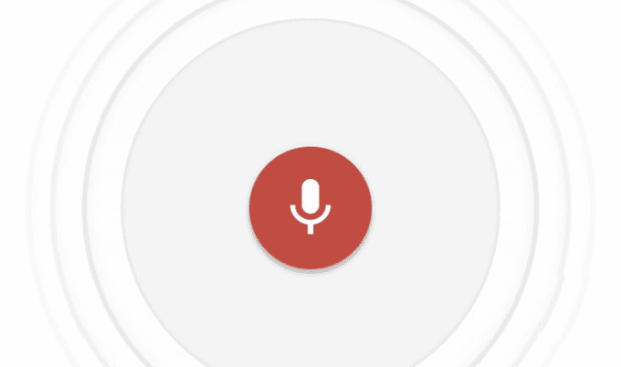

# 谷歌的 iOS 键盘获得了它真正缺乏的一个功能:语音输入 

> 原文：<https://web.archive.org/web/https://techcrunch.com/2017/02/23/googles-ios-keyboard-gets-the-one-feature-it-really-lacked-voice-typing/>

# 谷歌的 iOS 键盘获得了它真正缺乏的一个功能:语音打字

我真的很喜欢 Gboard。自从谷歌在 2016 年 5 月推出它[以来，它一直是我的主要 iOS 键盘，也是我坚持使用超过一周的唯一第三方 iOS 键盘。](https://web.archive.org/web/20221207060549/https://beta.techcrunch.com/2016/05/12/google-launches-gboard-an-ios-keyboard-that-lets-you-search-without-a-browser/)

但它缺少一个 iOS 自带键盘多年来一直提供的显著功能:语音转录。不再是了！

今天早上，谷歌发布了对 Gboard 的更新，带来了基于语音的输入，以及对一系列新语言的支持(总数达到 15 种)，并支持 iOS 10 中的新表情符号。

要激活语音输入，当然是在你确保更新之后，只需按住空格键上的麦克风图标一两秒钟，然后松开。一个新的屏幕(实际上是内置在母 Gboard 应用程序中的，否则你在安装后几乎看不到它)将带着一个脉冲麦克风滑入。说出你要说的话，谷歌会相应地转录，然后它会把你的话转储到你最后的文本字段。

这是一个*小*比 iOS 自己的实现更不可靠，但它完成了工作。这确实是一个非常聪明的解决办法:苹果不允许第三方键盘访问麦克风，但第三方*应用*——包括充当第三方键盘“父母”的应用(给它一个主屏幕图标，从而使它容易删除)——可以。因此，Gboard(键盘)将你转储到 Gboard(应用程序)进行语音识别，然后将结果作为键盘输入发送回你正在使用的任何应用程序。