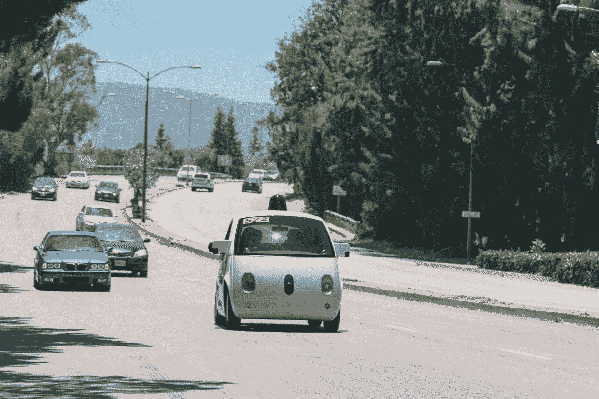

# 谷歌最新的无人驾驶汽车原型现在出现在山景城街道上

> 原文：<https://web.archive.org/web/https://techcrunch.com/2015/06/25/googles-latest-self-driving-car-prototypes-are-now-on-mountain-view-streets/>

# 谷歌最新的无人驾驶汽车原型现在出现在山景城的街道上

谷歌对其自动驾驶汽车项目的状态进行了更新——其车辆的最新原型已经可以上路，并且[已经在山景城](https://web.archive.org/web/20230319060118/https://plus.google.com/+SelfDrivingCar/posts/ddVeqLx5BuX)行驶。这些是谷歌在 12 月份展示的[相同的可爱原型](https://web.archive.org/web/20230319060118/https://techcrunch.com/2014/12/22/heres-what-googles-first-custom-built-self-driving-car-looks-like-now/)，完全由谷歌以无人驾驶为理念建造。

然而，无人驾驶汽车在城市街道上并非没有司机——在测试的这一阶段，它们的驾驶舱中有“安全司机”，配备了可拆卸的方向盘、油门和刹车踏板，以确保它们可以在必要时进行控制。在自动驾驶模式下，它们的最大时速为 25 英里/小时，并且使用的系统软件与之前雷克萨斯制造的事故最少的测试车所使用的系统软件相同。

谷歌的按钮可爱的熊猫汽车也将变得更加时髦，这要归功于该公司本周早些时候启动的一个新的[项目](https://web.archive.org/web/20230319060118/https://plus.google.com/+SelfDrivingCar/posts/ddVeqLx5BuX)向加州艺术家征集汽车外观的独特设计。基本上，在“我的社区，我的邻居”的总主题下，他们正在寻找使机器人车辆更容易接近的设计

不管从数字上看汽车有多安全，人类不会那么容易被统计数据所打动，因此谷歌能够做的任何事情都可能不会白费。