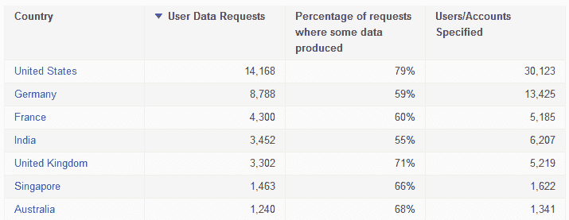

# 谷歌最新透明度报告在政府请求数量方面创下更多记录 

> 原文：<https://web.archive.org/web/https://techcrunch.com/2016/10/12/googles-latest-transparency-report-sets-more-records-in-government-request-numbers/>

# 谷歌最新的透明度报告在政府请求数量方面创下更多记录

谷歌已经将 2016 年上半年的数据添加到其正在进行的[透明度报告](https://web.archive.org/web/20221226044816/https://www.google.com/transparencyreport/userdatarequests/)页面，这些变化几乎和你预期的一样:更多的请求。一些轻浮的，一些合法的，一些绝密的。

对用户信息的请求总数跃升至创纪录的 44，943 次(高于前六个月的 40，677 次)，美国一如既往地以 30，123 次领先——第二名是德国，然后是法国，印度和英国紧随其后。

理事会新成员:阿尔及利亚、白俄罗斯、开曼群岛、萨尔瓦多、斐济和沙特阿拉伯。欢迎光临！不过，没有一个网站提出了超过几个请求。

英国超过了印度，但除此之外，前五名没有变化。

这些请求中平均有 64%被批准，尽管谷歌没有(在大多数情况下也不能)给出请求了哪些账户和数据的细节。

内容移除请求的统计数据更加详细，但这些数据仍然来自 2015 年末；我相信我们很快就能看到最新的数据。

该公司的执法和信息安全总监 Richard Salgado[在一篇博客文章](https://web.archive.org/web/20221226044816/https://blog.google/topics/public-policy/building-surveillance-reform/)中提到，一封国家安全信件被公开，改变了 2015 年下半年收到的 nsl 的数量:曾经的 0-499 现在是 1-499。闻起来像自由！

另一方面，外国情报监视法案的请求在同一时期有所增加，达到 21，000 以上，远远高于今年上半年的 16，000 左右。我们暂时还不知道 2016 年的数据，因为必须延迟六个月才能上报。自 2009 年以来，这或多或少是一个持续的攀升，所以不要指望数字会下降，或者即使下降，也不会下降太多。