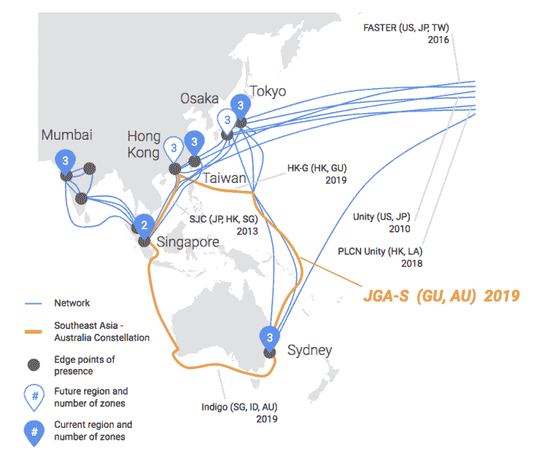
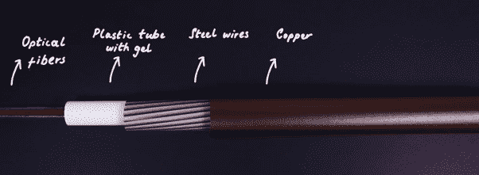

# 谷歌最新海底电缆项目将连接日本和澳大利亚 

> 原文：<https://web.archive.org/web/https://techcrunch.com/2018/04/04/googles-latest-undersea-cable-project-will-connect-japan-to-australia/>

当你是一家像谷歌这样大的公司时，你每天都需要做出建设还是购买的决定，无论是购买一家公司还是建设软件，还是租用海底电缆的时间，还是建设自己的公司。今天，该公司宣布，它决定建造另一条海底电缆。这条线路将从日本到关岛，从关岛到澳大利亚。

这是一个很大的区域，大约 9500 公里或 6000 英里，这是一项重大工程。该公司不会轻视这种规模的项目，但他们认为从经济和技术角度来看，这符合他们的最佳利益。这条光缆被命名为 JGA，它将与现有的港-新-澳光缆连接起来，形成一个覆盖亚太地区的环。

地图:谷歌

“JGA 由 NEC 公司和阿尔卡特海底网络公司共同建造。JGA 南部的部分由 AARnet、Google 和 RTI-C 组成的财团开发，而 JGA 北部的部分是由 RTI-C 开发的私人电缆，”根据今天在该项目上发表的一篇博客文章。

谷歌首席工程师 Vijay Vusirikala 说，建造电缆的决定归结为一个与谷歌使用规模相关的经济决定，他的专业涉及海底电缆。当你达到一定的使用水平时，建造自己的电缆比租用别人的电缆更划算。Vusirikala 解释说:“这实质上是大规模建设基础设施，并通过规模获得优化效益。”

海底电缆的各部分。图表:谷歌

“我们一直使用现有电缆连接该地区的不同部分。他补充说:[的这一宣布是【我们正在进行的】一系列投资的一部分，以使我们扩大规模并改善经济。](https://web.archive.org/web/20221209140645/https://techcrunch.com/2018/01/16/google-cloud-infrastructure-expansion-to-continue-with-three-new-undersea-cables/)

今天的声明实际上只是一个项目的开始，这个项目可能需要很长时间才能完成。它从在工厂里建造电缆开始。这些电缆可以持续使用，并能承受躺在海底的条件。每条电缆都包含由极高质量玻璃制成的光纤电缆，可以承载 100 兆兆比特的流量。从长远来看，谷歌表示这相当于每秒 63，000 张照片，或超过 650，000 个同步高清视频流。

在此过程中，一个专家团队将为电缆规划出最佳路线，以实现最短的延迟，同时考虑最简单的电缆铺设方式。这是一种平衡行为。

最后，他们把电缆放在大线轴上，把线轴放在船上，然后把电缆放在海底。每条电缆每隔 80 公里就有一个中继器，将信号在电缆中传播得更远。

谷歌全球网络基础设施团队的 Michael Francois 表示，这些电缆可以持续使用，但偶尔也会断裂。“一旦投入使用，它们一般不会失败。它们被设计成长时间坐在那里。一般来说，当事情发生时——可能是丢下一个锚，打破了电缆的铠装。如果它真的坏了，就需要用船来修理，”他说。

该项目是全球 300 条电缆网络的一部分。在过去几年中，这个数字一直在上升，因为云提供商和脸书、亚马逊等超大规模企业需要更多的跨地区连接。

__

这段视频解释了电缆是如何从工厂到达海底的。

[https://web.archive.org/web/20221209140645if_/https://www.youtube.com/embed/H9R4tznCNB0?start=165&feature=oembed](https://web.archive.org/web/20221209140645if_/https://www.youtube.com/embed/H9R4tznCNB0?start=165&feature=oembed)

视频