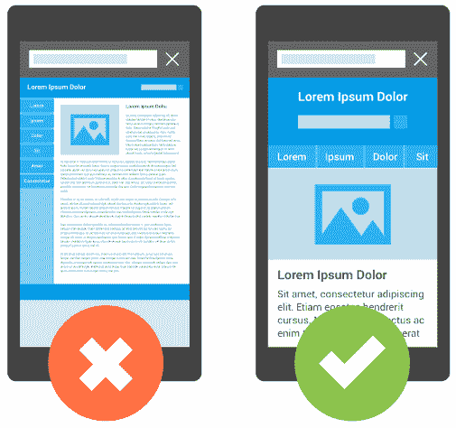

# 谷歌最新的移动搜索算法更新使得拥有一个移动友好网站变得更加重要

> 原文：<https://web.archive.org/web/https://techcrunch.com/2016/03/16/googles-makes-having-a-mobile-friendly-site-more-important-get-page-one-listing-seo/>

# 谷歌最新的移动搜索算法更新使得拥有一个移动友好网站变得更加重要

如果你的网站在手机上不容易使用，谷歌会通过降低它在手机搜索结果页面上的排名来惩罚它。为了给出版商更多提供手机友好页面的动力，谷歌今天宣布，在五月份，它将会提高手机页面的重要性，而不支持手机的网站将会比以前在 T2 排名更靠后。

正如该公司在去年第一次[引入](https://web.archive.org/web/20230131000959/https://webmasters.googleblog.com/2015/04/rolling-out-mobile-friendly-update.html)这一排名信号时指出的，这里的基本想法是给移动用户更好的搜索体验。幸运的是，大多数出版商已经注意到了这一呼吁，现在提供相当不错的手机页面。

谷歌早在 2014 年就开始了这项工作，只是简单地用一个它认为移动友好的徽章来标记网站。几个月后，它也开始用这个作为排名信号。

速度一直是谷歌的困扰之一，在过去的几个月里，该公司还推出了 AMP T1，这使得网站在移动设备上的加载速度更快。

虽然今天[没有使用 AMP 作为排名信号](https://web.archive.org/web/20230131000959/http://searchengineland.com/google-amp-not-yet-a-search-ranking-signal-243498)，但它确实突出了 AMP 页面。不过，很有可能，它会在未来开始这样做，随着时间的推移，它会增加使用 AMP 的重要性，就像它最初努力提高移动友好网站的排名一样。

谷歌为[提供了许多工具](https://web.archive.org/web/20230131000959/https://www.google.com/webmasters/tools/mobile-friendly/?utm_source=wmc-blog&utm_medium=referral&utm_campaign=mobile-friendly)，可以让你判断你的网站目前是否被认为是移动友好的，谷歌的网站管理员工具也有一个完整的部分[来强调你网站上的“移动可用性错误”。](https://web.archive.org/web/20230131000959/https://www.google.com/webmasters/tools/mobile-usability)