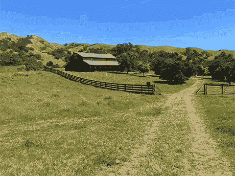

# 谷歌的新应用程序让你的 iOS 实时照片不那么抖动，更棒 

> 原文：<https://web.archive.org/web/https://techcrunch.com/2016/06/07/googles-new-app-makes-your-ios-live-photos-less-shaky-and-more-awesome/>

# 谷歌的新应用程序让你的 iOS 实时照片不那么抖动，而且更棒

从设计上来说，苹果的实时照片是大多数人不会真正考虑的东西。你只需像往常一样拍摄静态照片，iOS 会自动捕捉照片拍摄前后的一些镜头，并将其转换为小动画。

有时这些动画是惊人的——你永远不会发现的小巧合。不过，通常情况下，它们模糊不清，摇摇欲坠，你不会想要的。

谷歌刚刚发布了一个应用程序来尝试解决这个问题。

这款名为“动态剧照”的新应用的存在完全是为了改善你的现场照片。该应用借鉴了谷歌在 YouTube 和其他项目上的视频稳定工作，分析你的实时照片，并在短时间内做出一系列疯狂的事情:

*   扔出模糊的框架，并试图裁剪出你刚刚把手机放回口袋的位置

*   决定什么在背景中，什么在前景中，并且实际上隔离它们以便更好地稳定(注意下面稳定的 GIF 中谷仓和它后面的山之间强烈的[视差效果](https://web.archive.org/web/20230130233514/https://en.wikipedia.org/wiki/Parallax)
*   尝试确定循环的最佳开始/结束点
*   制作 GIF 供大家分享

该应用目前只存在于 iOS 上——这是有道理的，因为实时照片几乎完全是 iOS 的事情。第三方一直在为 Android 开发自己的实时照片替代品，但没有一个真正占据主导地位。

尽管如此，这款*确实*进一步推动了谷歌工程师对 iOS 越来越感兴趣的想法——这是近年来第二款首先登陆 iOS 的谷歌应用，此前[于 5 月发布了他们(相当不错)的 iOS 键盘 Gboard](https://web.archive.org/web/20230130233514/https://techcrunch.com/2016/05/12/google-launches-gboard-an-ios-keyboard-that-lets-you-search-without-a-browser/)。虽然 Gboard 从 Android 键盘借鉴了很多东西，但它也做了很多内置 Android 键盘没有做的事情——比如 GIF 搜索或表情符号自动建议。

你可以在这里的 [iOS 应用商店找到运动照片。](https://web.archive.org/web/20230130233514/https://itunes.apple.com/us/app/motion-stills-create-live/id1086172168?ls=1&mt=8)

