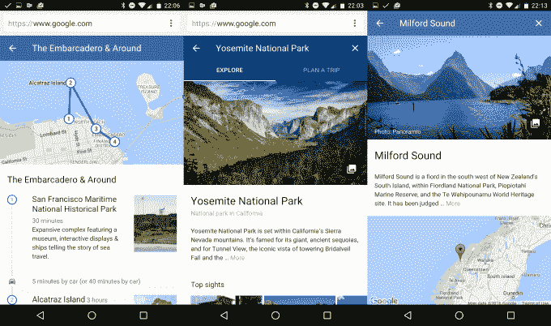

# 谷歌的新目的地功能让你可以直接从手机上的搜索引擎 TechCrunch 计划行程

> 原文：<https://web.archive.org/web/https://techcrunch.com/2016/03/08/googles-new-destinations-feature-lets-you-plan-trips-right-from-its-search-engine-on-mobile/>

# 谷歌新的目的地功能让你可以直接通过手机搜索引擎来计划行程

谷歌正在通过一项新功能使旅行或度假计划变得比以往任何时候都更容易，这一新功能让你可以在手机上通过搜索引擎查找目的地，包括航班和酒店价格。

“谷歌目的地”是由某些搜索触发的，如“西班牙冲浪”、“新西兰徒步旅行”或“科罗拉多滑雪”，也可以在用户搜索特定国家、州、城市或其他目的地时找到。

这项服务只能在移动设备上使用——谷歌解释说，去年移动设备上的旅游相关问题激增了 50%——但是，除了方便之外，它还打算提供探索。目的地包括活动建议，以策划行程的形式，最初在全球 201 个城市开展。所以，如果你想去一个新的地方，但不确定在那里该做什么，谷歌希望给你一些建议，说服你去订票。

关于预订本身，Google Destinations 将用户发送到航空公司网站来完成他们的购买，但在这一步之前，它确实提供了一些漂亮的功能。除了估计机票和酒店的费用，它还允许用户改变他们的旅行日期，以帮助显示价格最低的时间，或者一年中特定时间的费用。还有一个“探索”标签，让你了解每个目的地的天气，这是计划旅行时的一个重要因素。

谷歌目的地最初在美国和少数其他国家推出。从我们使用它的时间来看，我们发现它是快速和有用的。人们是否会通过手机自发地购买大件商品还有待观察，但谷歌创造了街景，这是一种幻想的环球旅行服务，可以像其他人一样占用你的时间，现在满足你的旅行欲望变得容易多了。如果没有别的，目的地是一个比糖果粉碎更好的方式来填补巴士上的五分钟的停机时间。

[https://web.archive.org/web/20221211032514if_/https://www.youtube.com/embed/EnlsEyN7qmw?feature=oembed](https://web.archive.org/web/20221211032514if_/https://www.youtube.com/embed/EnlsEyN7qmw?feature=oembed)

视频