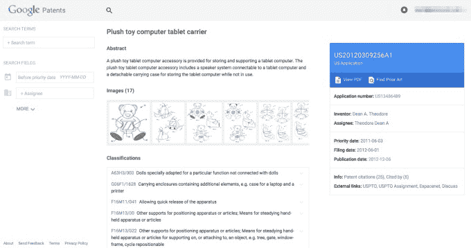
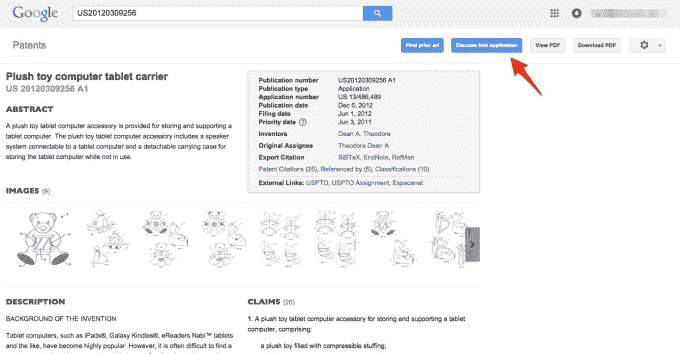

# 谷歌新的简化专利搜索现在整合了现有技术和谷歌学术 

> 原文：<https://web.archive.org/web/https://techcrunch.com/2015/07/16/googles-new-simplified-patent-search-now-integrates-prior-art-and-google-scholar/>

谷歌在专利世界的许多方面都扮演着重要角色——作为[创造者](https://web.archive.org/web/20221205114352/http://blogs.wsj.com/digits/2015/01/12/ibm-wins-most-patents-again-but-google-apple-climb-in-rankings/)、[评论家](https://web.archive.org/web/20221205114352/https://beta.techcrunch.com/2013/04/05/google-blackberry-earthlink-and-red-hat-take-a-stand-against-patent-trolls-ask-ftc-doj-to-do-the-same/)、[诉讼律师](https://web.archive.org/web/20221205114352/http://bits.blogs.nytimes.com/2014/05/16/apple-and-google-end-patent-fights/?_r=0)、[买家](https://web.archive.org/web/20221205114352/https://beta.techcrunch.com/2015/04/27/google-launches-a-marketplace-to-buy-patents-from-interested-sellers/#.zewlyd:Ckbp)和[大数据索引器](https://web.archive.org/web/20221205114352/http://www.techmeme.com/130918/p48#a130918p48)。今天，它揭开了最后一个类别中旗舰产品的面纱:它推出了新版本的[谷歌专利](https://web.archive.org/web/20221205114352/http://patents.google.com/)搜索，现在还将纳入现有技术和谷歌学术引文的相关结果。

谷歌表示，旧的 google.com/patents 链接及其独立的现有艺术搜索器目前将继续工作。

在一个经常充斥着晦涩难懂的文字、不相关的信息、烟幕和大量专利的技术领域(根据谷歌副总理事会 Allen Lo 和专利工程师 Ian Wetherbee 的说法，仅 2014 年就有 60 万份申请)，谷歌的主题是简单，无论是在功能还是用户界面方面。

这个想法是，新的专利搜索将更容易被该领域的专家以及普通公众用来查找专利和相关材料。鉴于以前可能从未考虑过专利的开发者和创始人对保护知识产权越来越感兴趣，这可能会被证明是特别有用的。

这不是谷歌第一次调整其专利搜索。早在 2012 年，该公司实际上[关闭了专利](https://web.archive.org/web/20221205114352/https://beta.techcrunch.com/2012/04/20/spring-cleaning-google-shuts-down-patent-search-one-pass-google-related-more/)的独立搜索页面，转而将其纳入主搜索，在那里你可以通过[基本的谷歌网络搜索](https://web.archive.org/web/20221205114352/https://www.google.com/)或[www.google.com/patents](https://web.archive.org/web/20221205114352/https://www.google.com/patents)来尝试查找专利。具有讽刺意味的是，今天在[patents.google.com](https://web.archive.org/web/20221205114352/https://patents.google.com/)强调新体验有点回到老路线。

但这并不意味着谷歌将专利放在次要位置。恰恰相反:在过去的几年里，该公司已经将搜索范围扩大到其他国家的专利。几个月前，[谷歌推出了一个临时市场](https://web.archive.org/web/20221205114352/https://beta.techcrunch.com/2015/04/27/google-launches-a-marketplace-to-buy-patents-from-interested-sellers/#.zewlyd:Ckbp)，供人们出售专利——谷歌是唯一的买家。(我们已经要求更新该实验的进展情况，以及未来是否会有更多的这方面的实验。)

在如何发展专利法和专利申请方面，[也非常直言不讳，将坏人(也就是骗子)与好人分开。](https://web.archive.org/web/20221205114352/http://www.uspto.gov/sites/default/files/documents/2015quality_e_cisco_06may2015.pdf)

今天的更新包括三个主要方面:

第一个是一个单一的搜索界面，谷歌将整合专利和现有技术的搜索——后者是人们搜索一个想法以前是否获得过专利或被代理的主要方式之一。虽然许多专利搜索(包括在 USPTO 自己的网站上)要求人们知道如何“阅读”专利，以创建正确的搜索字符串来找到他们要找的东西。相反，谷歌将这一过程分成不同的领域，更像用户在其他网站的高级搜索中可能遇到的那些领域。

除了现有技术，谷歌还通过[谷歌学术](https://web.archive.org/web/20221205114352/https://scholar.google.com/)将另一个可视化工具整合到专利搜索中，其垂直搜索专注于学术研究和其他学术文献。

在谷歌学术上已经有了一种搜索专利相关文章的方法(在主搜索窗口底部的一个小方框中打勾)。现在，谷歌说它已经使用 CPC 分类对整个谷歌学术数据库进行了索引。CPC 代表合作专利分类，由美国和欧洲共同开发，旨在更好地标准化专利和专利相关信息的描述方式。

今天正在发生变化的第三个领域与谷歌如何重新思考其在大数据搜索领域的更大使命有关。谷歌表示，现在它将以集群的形式呈现结果，这种逻辑分组将使围绕主题查看结果变得更加容易。

这也非常针对更随意的专利研究者。“改进后的谷歌专利根据 CPC 代码将专利和非专利搜索结果聚集在一起，这样用户就可以按逻辑分组进行审查。这也允许用户深入到相关的技术领域，而不必理解 CPC 系统。该公司指出:“从这些聚类中，可以通过添加关键词或其他参数来进一步细化搜索。

另一个有趣的细节是，虽然谷歌数据库中的许多现有技术和专利文件可能来自美国以外的国家，但它在幕后使用谷歌翻译和机器学习，所以如果你用英语搜索某样东西，你会从其他地方得到仍然与你的关键词匹配的结果。这不是一个新功能，但谷歌称它并不广为人知(或可能使用得很多)。

随着更新，也出现了一些有趣的变化:旧的专利搜索界面包括一个讨论栈交换专利的链接。这种情况已经消失，但还没有完全消除。堆栈交换讨论链接现在位于标记为“讨论”的“外部链接”部分。谷歌继续与专利信息门户网站 IFI 声明合作获取部分数据。

下面是你通过 www.google.com/patents 获得的界面截图。

*更新了谷歌和 IFI 声明的更多细节*