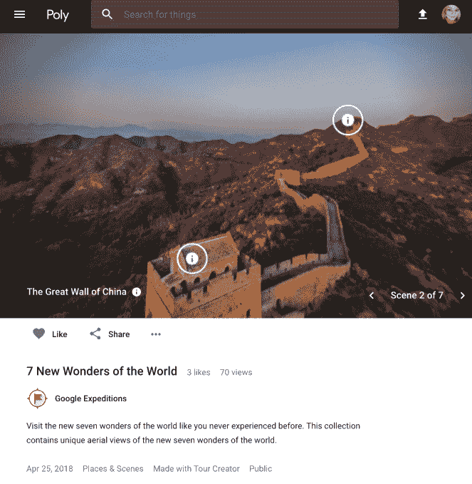

# 谷歌新的游览创建器让学生们可以制作自己的虚拟现实游览 

> 原文：<https://web.archive.org/web/https://techcrunch.com/2018/05/09/googles-new-tour-creator-lets-students-make-their-own-vr-tours/>

Google today [为教师和学生推出了一款名为 Tour Creator 的新工具，它允许任何人使用来自 Google 街景的图像或自己的 360 度照片来创建自己的虚拟现实之旅。新应用程序旨在与谷歌 Cardboard 和谷歌现有的虚拟现实“实地考察”应用程序](https://web.archive.org/web/20221025221959/https://www.blog.google/topics/education/tour-creator-schools-vr/)[探险](https://web.archive.org/web/20221025221959/https://techcrunch.com/2015/05/28/google-launches-expeditions-an-app-for-shared-virtual-school-field-trips/)配合使用。

探险的目标是让人们虚拟地环游世界，去看看那些他们可能永远没有机会亲自去的遥远的地方——比如南极洲或马丘比丘。谷歌表示，自 2015 年[探险队抵达以来，](https://web.archive.org/web/20221025221959/https://techcrunch.com/2015/05/28/google-launches-expeditions-an-app-for-shared-virtual-school-field-trips/)超过 300 万学生已经虚拟地游览了全球各地。

现在，这个想法是让学生和老师自己建立自己的 VR 体验和故事，而不需要技术知识。

相反，使用 Tour Creator，任何人都可以从他们的计算机上创建一个身临其境的 360 度游览。

要使用这项服务，你只需点击开始，给旅程起个名字，然后上传封面照片。然后，你可以在谷歌地图上搜索某个地方或景点，或者上传你自己的 360 度照片来设计你旅行的“场景”这些场景还可以包含按钮，您可以点按这些按钮来了解照片中该地点的更多信息。

当旅行结束后，你可以选择将其公开发布到谷歌的 3D 内容库 [Poly](https://web.archive.org/web/20221025221959/https://poly.google.com/) ，这样其他人也可以体验这次旅行。

例如，谷歌发布了一个名为“[世界七大新奇迹](https://web.archive.org/web/20221025221959/https://poly.google.com/view/8v-I0wldO1r)”的保利之旅，其中包括泰姬陵、中国长城、罗马圆形大剧场等景点。另一位用户发布了谷歌 I/O 开发者大会之旅，因此人们可以看到谷歌本周的大活动是什么样的。

在 Poly 上的旅行页面上，游客可以喜欢并分享旅行到社交媒体，或抓取嵌入代码放在自己的网站上——如学校或教室的网站。

你可以在网络浏览器中以身临其境的照片形式观看游览，也可以在谷歌简单的虚拟现实浏览器 [Cardboard](https://web.archive.org/web/20221025221959/https://vr.google.com/cardboard/) 中观看。

谷歌表示，今年晚些时候，它将允许用户将旅行直接导入到 Expeditions 应用程序中。

[https://web.archive.org/web/20221025221959if_/https://www.youtube.com/embed/L-g5Efn-ac0?feature=oembed](https://web.archive.org/web/20221025221959if_/https://www.youtube.com/embed/L-g5Efn-ac0?feature=oembed)

视频

