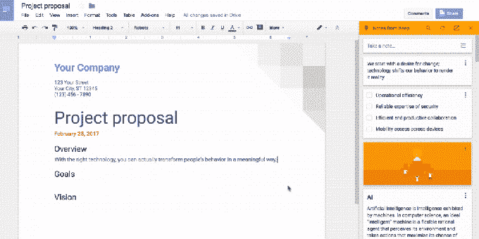

# 谷歌的笔记应用 Keep joins G Suite 现在集成了谷歌文档

> 原文：<https://web.archive.org/web/https://techcrunch.com/2017/02/28/googles-note-taking-app-keep-joins-g-suite-now-integrates-with-google-docs/>

# 谷歌的笔记应用 Keep joins G Suite，现在集成了谷歌文档

[Google Keep，【Evernote 和微软 OneNote 等笔记应用的竞争对手，](https://web.archive.org/web/20230306050601/https://keep.google.com/)[今天正在整合](https://web.archive.org/web/20230306050601/https://www.blog.google/products/g-suite/capture-ideas-google-keep-bring-them-life-google-docs/)谷歌针对企业的应用套件， [G Suite](https://web.archive.org/web/20230306050601/https://gsuite.google.com/) (之前，你的领域的谷歌应用套件)。这使得 Keep 成为用户工作流程的一部分，用于捕捉想法、记下快速提醒或待办事项、创建清单、做会议笔记等。除了添加到 G Suite 之外，Google Keep 现在也正在与 Google Docs 集成。

谷歌解释说，这意味着你可以将 Keep 中的笔记拖放到你的工作文档中。此功能只能通过 web 使用，并且要求您首先在浏览器中加载并打开文档。然后，您将从 Tools 菜单访问 Keep notepad，它将您的 Keep notepad 放置在 Docs 用户界面的侧边栏中。

从那里，您将能够获取笔记，包括图像和清单，并将它们直接放入您的文档中。

此外，您可以从“谷歌文档”中搜索您的 Keep notes，并在使用“文档”时添加新的笔记。要完成后一项任务，您将选择文档中的文本，然后右键单击所选内容并选择“保存以保存记事本”

这种集成的巧妙之处在于，当以这种方式添加时，注释还会包含一个指向源文档的链接。

鉴于许多企业、政府和教育用户可能已经在自己使用该应用程序，将 Keep 扩展到消费者用户群之外的举措是有意义的。作为 G Suite 的一部分，这些以业务为中心的笔记现在可以安全地保存在公司自己的域中，在那里它们可以得到管理、支持和搜索。

Keep 自今日起对 G Suite 客户开放，可在[【Android】](https://web.archive.org/web/20230306050601/https://goo.gl/mz8tBw)[iOS](https://web.archive.org/web/20230306050601/https://itunes.apple.com/us/app/google-keep-your-thoughts/id1029207872?mt=)[Chrome](https://web.archive.org/web/20230306050601/https://goo.gl/vP2cgI)或[web](https://web.archive.org/web/20230306050601/http://keep.google.com/)上使用。