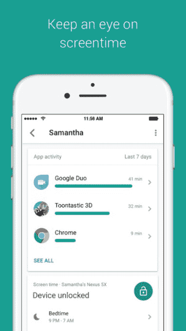

# 谷歌的家长控制软件 Family Link 登陆 iOS 

> 原文：<https://web.archive.org/web/https://techcrunch.com/2017/04/14/googles-parental-control-software-family-link-hits-ios/>

今年 3 月，谷歌为使用 Android 设备的孩子的父母推出了自己的家长控制软件，名为 Family Link T1，但有一点问题。为了让系统正常工作，父母和孩子都需要使用安卓系统。这种情况现在已经改变了，因为父母用于配置和监控孩子设备使用的应用程序刚刚在 iOS 设备上[推出](https://web.archive.org/web/20221209141635/https://itunes.apple.com/us/app/google-family-link/id1150085200?mt=8)。

这意味着妈妈或爸爸可以是 iPhone 用户，但仍然可以为使用 Android 的孩子管理孩子的屏幕时间、每日使用限制、设置“就寝时间”等。

鉴于 iOS 已经发展到[在美国智能手机市场占有](https://web.archive.org/web/20221209141635/https://www.macrumors.com/2017/03/15/ios-42-of-smartphone-market/)42%的份额，此次发布极大地扩展了 Family Link 的覆盖范围，Family Link 目前已在美国上市。

家长控制平台仍在测试中。当谷歌上个月推出这款软件时，它解释说父母必须首先申请邀请才能加入这个项目。谷歌的想法是，在更广泛地推广 Family Link 之前，先解决一些问题，并从早期用户那里获得反馈。

至于软件本身，Family Link 允许父母对他们的孩子如何使用他们的 Android 手机设置一些基本限制。它提供了一些工具，允许父母阻止或批准应用程序下载——类似于苹果设备上的 iCloud Family 共享“Ask”功能——或阻止已经安装的应用程序。

此外，父母可以通过每周和每月的活动报告跟踪孩子在哪些应用上花费了多少时间，按照设定的时间表远程锁定孩子的设备(设备“就寝时间”)，并配置每天的屏幕时间限制。

[gallery ids="1477055，1477054，1477053，1477052"]

周四发布的 iOS 版本与 Android 版本相比似乎没有任何新功能——它只是将家长控制应用程序移植到苹果平台上。

但是，如果您想尝试 Family Link，还需要注意其他一些注意事项。它仍然要求孩子拥有运行 Nougat (7.0)或更高版本的 Android 设备，或者拥有少数受支持的棉花糖设备之一。([Family Link FAQ 页面上有一个列表](https://web.archive.org/web/20221209141635/https://families.google.com/familylink/faq/)。)

当然，你也应该意识到这是软件的早期预览版，这里仍然可能有一些问题需要解决。

iOS 版 Family Link 可以在运行 iOS 9 或更高版本的设备上运行，并且是 App Store 上的一个[免费下载。](https://web.archive.org/web/20221209141635/https://itunes.apple.com/us/app/google-family-link/id1150085200?mt=8)